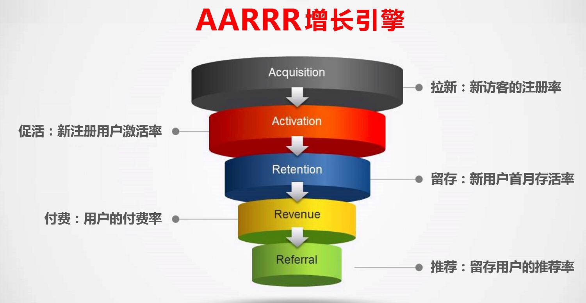
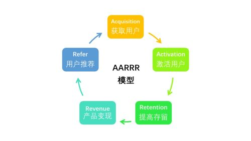

# AARRR模型

AARRR模型
什么是AARRR模型
AARRR模型因其掠夺式的增长方式也被称为海盗模型，是Dave McClure 2007提出的，核心就是AARRR漏斗模型，对应客户生命周期帮助大家更好地理解获客和维护客户的原理。

  

ARRR分别代表了五个单词，又分别对应了产品生命周期中的五个阶段：

Acquisition [获取]
用户从不同渠道来到你的产品
Activation [激活]
用户在你的产品上完成了一个核心任务(并有良好体验)
Retention [存留]
用户回来继续不断的使用你的产品
Revenue [收益]
用户在你的产品上发生了可使你收益的行为
Referral [推荐]
用户通过你的产品，推荐引导他人来使用你的产品

  

AARRR模型核心
AARRR模型指出了两个核心点：

1.以用户为中心，以完整的用户生命周期为线索。
2.把控产品整体的成本和收入关系，用户生命周期价值(LTV)远大于用户获取成本(CAC)与用户经营成本（COC）之和就意味着产品的成功。

AARRR各阶段的数据指标
Acquisition
日新登用户数（DNU）
每日注册并登录应用的用户数。

解决问题：
1.渠道贡献的用户份额。
2.宏观走势，确定投放策略。
3.是否存在大量垃圾用户。
4.注册转化率分析。

Activation
日活跃用户数（DAU）
每日登录过应用的用户数。

解决问题：
1.核心用户规模。
2.产品生命周期分析。
3.产品活跃用户流失，分解活跃用户。
4.用户活跃率，活跃用户计用户量。

周活跃用户数（WAU）
最近7日（含当日）登录过应用的用户数，一般按照自然周计算。

解决问题：
1.周期性用户规模。
2.周期性变化趋势，主要是推广期和非推广期的比较。

月活跃用户数(MAU)
最近一个月即30日（含当日）登录过APP的用户数，一般按照自然月计算。

解决问题：
1.用户规模稳定性。
2.推广效果评估。
3.总体用户规模变化。

日均使用时长(DAOT)
每日总计在线时长/日活跃用户数。

解决问题：
1.分析产品的质量问题。
2.观察不同时间维度的平均使用时长，了解不同用户群的习惯。
3.渠道质量衡量标准之一。
4.留存即流失分析的依据。

Retention
次日留存率(Day 1Retention Ratio)
定义：日新增用户在+1日登录的用户数占新增用户的比例。

三日留存率(Day 3Retention Ratio)
定义：日新增用户在+3日登录的用户数占新增用户的比例。

七日留存率(Day 7Retention Ratio)
定义：日新增用户在+7日登录的用户数占新增用户的比例。

解决问题：
1.APP质量评估。
2.用户质量评估。
3.用户规模衡量。
4.流失：统计时间区间内，用户在不同的时期离开APP的情况。

日流失率(Day 1Churn Ratio)
定义：统计日登录APP，但随后7日未登录APP的用户占统计日活跃用户的比例。

周流失率(Week Churn Ratio)
定义：上周登录过APP，但是本周未登录过APP的用户占上周周活跃用户的比例。

月流失率(Month Churn Ratio)
定义：上月登录过APP，但是本月未登录过APP的用户占上月月活跃用户的比例。

解决问题：
1.活跃用户生命周期分析。
2.渠道的变化情况。
3.拉动收入的运营手段，版本更新对于用户的流失影响评估。
4.什么时期的流失率较高。
5.行业比较和产品中期评估。

Revenue
付费率(PR或者PUR)
定义：付费用户数占活跃用户的比例。

解决问题：
1.产品的收益转化能力标准。
2.用户付费关键点和转化周期。
3.付费转化效果评估。

活跃付费用户数(APA)
定义：在统计时间区间内，成功付费的用户数。一般按照月计，在国际市场也称作MPU（Monthly Paying Users）。

活跃付费用户数的计算公式如下：
APA ＝ MAU × MPR

解决问题：
1.产品的付费用户规模。
2.APA的构成情况，鲸鱼用户、海豚用户、小鱼用户的比例以及收益能力。
3.付费群体的价值即整体稳定性分析。

平均每用户收入(ARPU)
定义：在统计时间内，活跃用户产生的平均收入。一般以月计。

平均每个用户收入的计算公式如下：
ARPU ＝ Revenue / User
Monthly ARPU ＝ Revenue / MAU

解决问题：
1.不同渠道用户质量的判断。
2.产品收益贡献分析。
3.活跃用户人均收入与投放成本的关系。

平均每付费用户收入(ARPPU)
定义：在统计时间内，付费用户产生的平均收入。一般以月计。

平均每付费用户收入的计算公式如下：
ARPPU ＝ Revenue / Payment User
Monthly ARPPU ＝ Revenue / APA

解决问题：
1.付费用户的付费能力和梯度变化。
2.付费用户的整体付费趋势和不同付费阶层差异。
3.对鲸鱼用户的价值挖掘。

生命周期价值(LTV)
定义：用户在生命周期内为创造的收入总和。可以看成是一个长期累积的ARPU。

对每个用户的平均LTV计算如下：
LTV ＝ ARPU × LT（按月或天计算平均生命周期）

其中，LT为Life Time（生命周期），即一个用户从第一次启动APP，到最后一次的时间，一般计算平均值，LT以月计，就是留存在APP的平均月的数量。例如，一款APP的ARPU＝￥2，LT＝5，那么LTV＝2×5＝￥10。

解决问题：
1.用户收益贡献周期。
用户群与渠道的利润贡献，LTV与CPA的衡量。
2.LTV不区分付费与非付费用户，看待整体的价值。

Referral
自传播也叫作病毒式传播。其中有一个重要的指标K因子（病毒指数）。

K因子的计算公式不算复杂，过程如下：
K ＝（每个用户向他的朋友们发出的邀请的数量）×（接收到邀请的人转化为新用户的转化率）。

假设平均每个用户会向20个朋友发出邀请，而平均的转化率为10%，则K＝20×10%＝2。
当K ＞ 1时，用户群就会像滚雪球一样增大。
当K ＜ 1时，用户群到某个规模时就会停止通过自传播增长。

参考资料
[1] MBA智库百科.AARRR模型.https://wiki.mbalib.com/wiki/AARRR%E6%A8%A1%E5%9E%8B
[2] .什么是AARRR模型？.https://cloud.tencent.com/developer/article/1560431