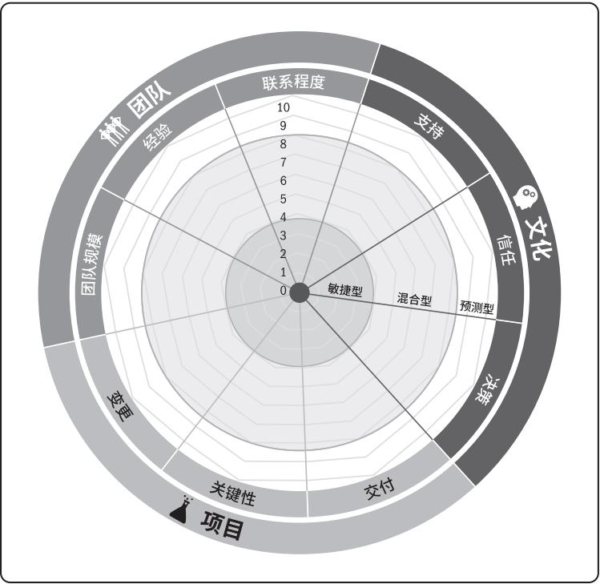

# 敏捷

敏捷思想
敏捷思想(Agile)代表了一种解决复杂问题的方法思想，它是一种实验型的学习过程。

边前进边学习。
预计到变化会出现。
拥抱变化。
检查和适应。
需要强调的是，敏捷是解决的是复杂问题，并不是一种普世的方法。所以传统的瀑布式方法并不会被敏捷完全替代。

## 四个核心价值

- 个体和互动 高于 流程和工具。
- 工作的软件 高于 详尽的文档。
- 客户合作 高于 合同谈判。
- 响应变化 高于 遵循计划。
- 尽管右项有其价值，我们更重视左项的价值。

## 十二条原则

- 我们最重要的目标，是通过持续不断地及早交付有价值的软件使客户满意。
- 欣然面对需求变化，即使在开发后期也一样。为了客户的竞争优势，敏捷过程掌控变化。
- 经常地交付可工作的软件，相隔几星期或一两个月，倾向于采取较短的周期。
- 业务人员和开发人员必须相互合作，项目中的每一天都不例外
- 激发个体的斗志，以他们为核心搭建项目。提供所需的环境和支援，辅以信任，从而达成目标。
- 不论团队内外，传递信息效果最好效率也最高的方式是面对面的交谈。
- 可工作的软件是进度的首要度量标准。
- 敏捷过程倡导可持续开发。责任人、开发人员和用户要能够共同维持其步调稳定延续。
- 坚持不懈地追求技术卓越和良好设计，敏捷能力由此增强。
- 以简洁为本，它是极力减少不必要工作量的艺术。
- 最好的架构、需求和设计出自自组织团队。
- 团队定期地反思如何能提高成效，并依此调整自身的举止表现。

## 生命周期 
- 迭代型生命周期
- 增量型生命周期
- 适应型生命周期 / 敏捷生命周期
- 混合型生命周期

敏捷实践中提到的四种生命周期，分别是预测型生命周期、迭代型生命周期、增量型生命周期和敏捷生命周期。

### 适用性评估雷达图
  

## 相关书籍
《敏捷实践指南》