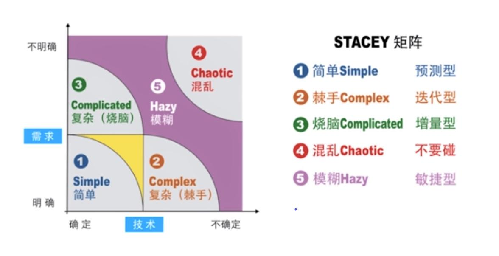
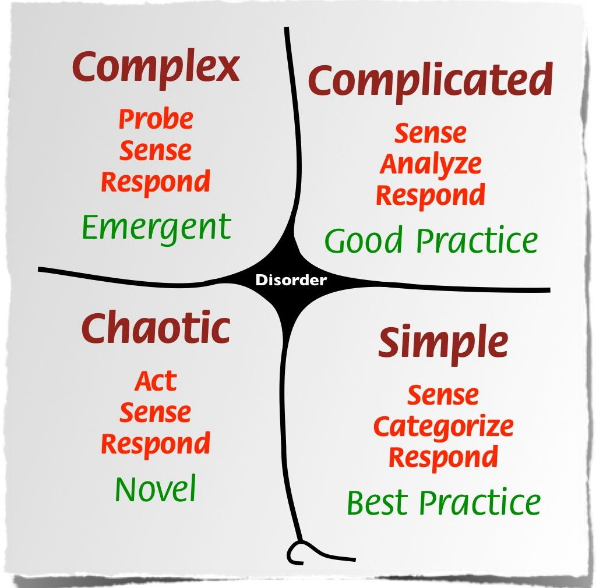

# 复杂系统

Stacey矩阵
1996年，alph D.Stacey在《组织的复杂性和创新》中提出了Stacey矩阵。

  

##### Simple
第一个区域，需求明确，技术（解决方案）也确定，这类项目就是简单的项目（Simple）；比如注册一个新公司，需求很明确，手续也很清楚，就那么几步规定动作，因此大量代理机构都可以帮你完成这个项目。
既然需求明确，怎么实现也清楚，最好提前把计划做到位，预测型开发模式最适合。

##### Complex
第二个区域，需求明确，技术却不确定，也就是说怎么实现不知道，这类项目叫复杂的项目（Complex），也叫棘手的项目。比如“无人驾驶”，这项目需求明确吧？“无人驾驶”四个字把需求说的明明白白，就是不要人开，车自己会走。但是“无人驾驶”研究了几十年，各种方法都试过了，一直也没搞定，最近随着人工智能技术的发展才让无人驾驶离现实越来越接近。
技术不确定，怎么实现不知道，只能摸索着来，推荐用迭代开发。

##### Complicated
第三个区域，技术很确定，需求却不明确，这类项目最坑爹，比如我们经常遇到这样的客户，让我们开发一个信息系统，问我们会什么技术。你都不耐烦了：“老子啥都会，这根本就不需要什么新技术，问题不是我会什么，关键是你到底要什么？”这类项目是烧脑型的项目（Complicated），愁死个人！
既然客户要什么还没想明白，那就想明白什么先做什么，你边做他边想，最好增量开发，分成多个阶段交付，减少推到重来的风险。

##### Chaotic
第四个区域，需求不清楚，怎么实现也不清楚，这叫混乱状态的项目（Chaotic）； 这类项目尽量别碰，基本是要失败的。

##### Hazy
第五个区域，就是图中紫色区域，不属于前四种区域的其它项目，属于模糊型（Hazy）项目。
需求和实现方案都不明确，最好用敏捷开发，适应性强，灵活机动，拥抱变化。

## 相关书籍推荐
- 《复杂》

复杂系统的定义
定义1：复杂系统是由大量组分组成的网络，不存在中央控制，通过简单运作规则产生出复杂的集体行为和复杂的信息处理，并通过学习和进化产生适应性。

定义2：具有涌现和自组织行为的系统。
如果系统有组织的行为不存在内部和外部的控制者或领导者，则也称之为自组织（self-organizing）。由于简单规则以难以预测的方式产生出复杂行为，这种系统的宏观行为有时也称为涌现（emergent）。

常用模型
Cynefin模型
Cynefin模型提供一个从因果关系复杂情度来分析当前情况而作决定的框架，提出有五个领域。

  

Simple 简单
Simple领域是一种已知的已知领域，表现为熟悉的、确定的和惯用的方式。 因果关系显然而见，处理手法为"感受－归类－反应" (Sense-Categorise-Respond)。

Complicated 繁杂
Complicated领域是一种已知的未知领域，表现为有规律、可预测的事务，可以被专家掌握。处理手法为"感受－分析－反应"　（Sense-Analyze-Respond）。

Complex 复杂
Complex领域是一种未知的未知领域，表现为乱流、不可预测、没有正确的答案、突发指示性模式和其他的竞争性思维。因果关系只能从检讨中反映出来，处理手法是"试探－感受－反应"　（Probe-Sense-Respond）。

Chaotic 混沌
Chaotic领域是一种不可知的未知领域，表现为高波动性和无序性。完全没有任何因果关系，处理手法为"行动－感受－反应"　（Act-Sense-Respond）。

Disorder 无序
如果连是属于以上哪个情况都不清楚的，这是一个无序的状态（disorder），等待参与者把情况安稳至上面四个其中之一的情况。