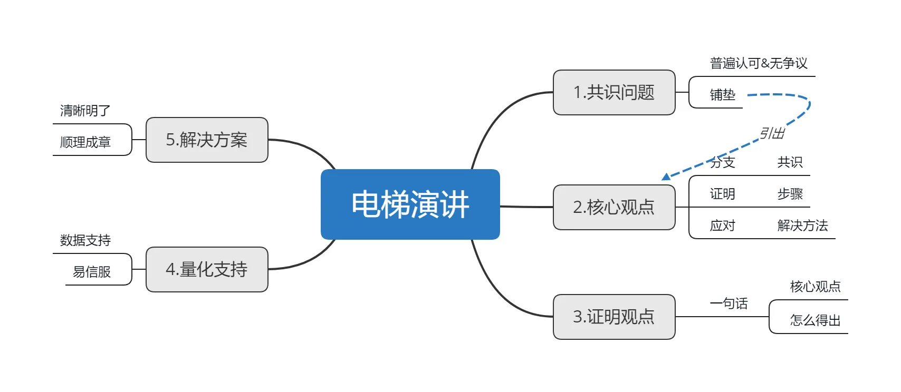
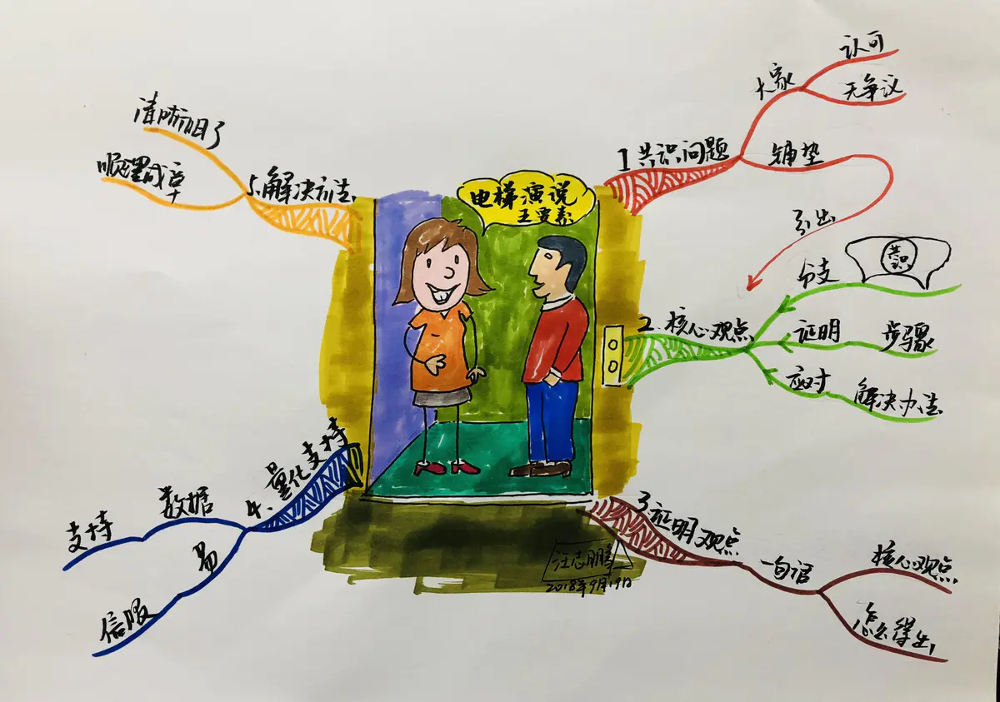

# 电梯演讲

30秒电梯理论所要求的是麦肯锡要求他的每一个业务人员，都必须有在30秒的时间向客户介绍方案的能力，在企业的整体运营中，30秒理论对企业的发展团队的执行与沟通都是有非常密切的关系的。

  

> 电梯演说在很多大型的咨询公司非常盛行，已然成为所有人的必修课。他们认为：再复杂的一个项目，如果不能在1分钟说清楚，都说明表达能力欠缺。这个套路的本意就是：即使与别人在电梯间的短暂相遇，你也能清楚准确的表达观点。

  

电梯演说在向大领导或者重要客户阐述时非常有效，因为他们时间有限，且还想听到层层到肉的逻辑表述。这个表达方式分为以下五个步骤。
第一步：共识问题
这是一个铺垫，为了引出你下面的观点，且记这个问题一定是大家都已经认可，不存在争议的问题，否则很容易在根上就被否定掉。

第二步：说出核心观点
这一步非常重要。
首先，它是共识问题下面的一个分支；
其次，剩下的步骤都是为了证明这个观点；
最后，你的解决办法也是要应对这个观点。

第三步：证明观点
用一句话说明怎么得出的核心观点。

第四步：量化支持
一定要用数据支持你的观点，这样才容易让人信服，要知道你面对的可不是一般的屌丝。

第五步：解决办法
如果前面几步做的很好，这一步就顺理成章了。
