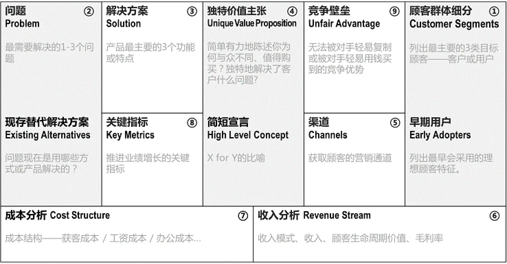
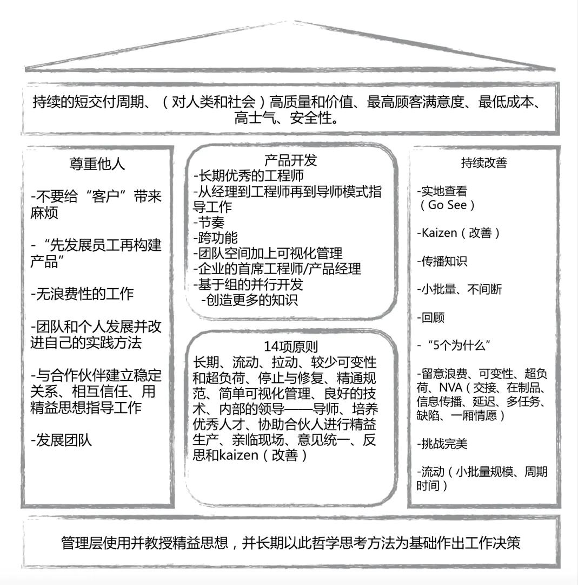

# 精益画布

精益画布( Lean Canvas)是早期创业者用于梳理创业思路（主要是商业模式）的一种方式。

精益画布通过对创业的思考，寻找市场的切入点，明确项目的价值，发现核心竞争优势着手点，定义盈利模式，确定接触用户的渠道，最终形成战略目标和行动计划，它是以可视化的形式，帮助创业者验证项目可行性，从而避免不不要的弯路，帮助降低甚至化解风险。

作为产品新人，在进行企业和产品分析时，没有头绪，缺乏逻辑，通过精益画布能够帮助聚焦关键点，更快学会如何分析，使得创业建立在一个扎实的基础之上，提高创业成功率。

精益画布模板

  

精益画布模板由9个部分组成：

1. 客户群体细分 Customer Segments
- 列出最主要的三类目标客户
- 列出最可能成为早期用户的客户群体
2. 问题 Problem
- 最需要解决的1-3个问题
- 现在替代解决方法
3. 解决方案 Solution
- 产品最主要的三个功能或特点。
4. 独特价值主张 Unique Value Proposition
- 简单有力地陈述你为何与众不同、值得购买？
- 独特解决了客户什么问题？
5. 渠道 Channels
- 获得顾客的营销通道
6. 收入分析 Revenue Stream
- 收入模式、收入、顾客生命周期价值、毛利率。
7. 成本分析 Cost Stucture
- 成本结构：获客成本、显性成本、隐性成本。
8. 关键指标 Key Metrics
- 推进业务增长的关键指标。
9. 竞争壁垒 Unfair Advanctage
- 无法被对手轻易复制或被对手轻易用钱买到的竞争优势。

## 精益思想
精益思想是适用任何组织消除浪费、创造价值的最强有力的工具。

五个原则
精益思想可以概述为5个原则：

精确地定义特定产品的价值；
识别出每种产品的价值流；
使价值不间断地流动；
让客户从生产者方面拉动价值；
永远追求尽善尽美。
清楚地了解这些原则，然后将这些原则一起加以实践，管理人员就可以充分利用精益技术，保持稳定的发展。

定义价值
精益思想的关键出发点是价值。价值只能在由最终客户来确定，而价值是由生产者创造的。
精益思想必须从一种自觉的尝试开始，通过与客户的对话，为具有特定功能的产品精确定义价值。形成一个明确的观点，知道什么是真正需要做的事是必要的，否则价值的定义肯定会被曲解。

识别价值流
识别价值流的含义是在价值流中找到哪些是真正增值的活动、哪些足叮以立即去掉的不增值活动，即浪费。精益思想要求价值流域中的各个企业重新思考其经营方法，共同发现浪费，消除浪费。

流动
由于根深蒂固的传统观念和做法，如部门的分工、大批量生产等等。阻断了本应动起来的价值流。精益将所有的停滞视为企业的浪费，用持续改进、JIT、单件流等方法创造价值的连续流动。

拉动
理解拉动思想的最佳途径，要从一个实际客户表示对一件实际产品的需要开始，然后倒推至，把合意的产品交给客户所需要的各个步骤，而不是把用户常常不想要的产品硬推给他们。拉动原则更深远的意义在于能抛开预测，直接按用户的实际需要进行生产。

尽善尽美
价值流中浪费的步骤不可能通过一次改善彻底消除，浪费是被不断发现和具体化的。这就要求我们根据当前的价值流状况设定一个新的目标，重新开始流动和拉动的过程，发现和消除更多的浪费，不断地持续这改边过程。

### 精益小屋

  

精益小屋（Lean house）是基于精益思想延伸出的一种结构化知识。它由4个部分组成，分别是：

1. 顶层
- 价值交付
2. 中层
- 尊重他人
- 产品开发流
- 持续改善（Kaizen）
3. 底层
- 领导力

价值交付是精益的目标，通过中间支柱的思想与方法实现精益的目标，向客户交付价值。在实施精益的过程中，领导力是精益的基础。领导者要改变原来命令和控制的管理方式，转变为支持者、教育者来领导团队。

## 精益创业
在精益创业出现之前，硅谷流行一种叫做GBF（Get Big Fast）的创业思维。依赖于天才人物的天才设想，所有的赌注都集中在发布那一刻。所以GBF又被形象地称为“火箭发射式创业思维”。

在这种思维模式中，用户需求和痛点被认为是已知的，依赖于完美的计划和执行。而之后出现的精益创业思维认为用户需求和痛点是未知的，想象中的解决方案和实际情况往往有很大差别。

> 想象的用户痛点 ≠ 真实的用户痛点
> 想象的解决方案 ≠ 有效的解决方案

精益创业的目的就是要找到用户的准确需求，不断尝试去逼近最有效的解决方案。简而言之，就是低成本地快速试错，这也就是精益思想的价值。

### 理论基石
杰弗里·摩尔在《跨越鸿沟》一书出提出三个基本观点。

- 找到痛点：找到用户使用产品的关键痛点，挖掘出细分市场，通过单点突破的思维跨越鸿沟。
- 以点带面：以单个细分市场来撕开整个市场。
- 聚焦与快速决策：在单点突破之前，不需要考虑后续的动作和市场布局。
  
冯·希波尔在《大众创新》中提出，在心产品或新技术的采用者中有一类人能对创新做出贡献，称作“领先用户”。他们对技术敏感，有创新的欲望，不仅局限于自己使用，还会积极为使用场景中的痛点找到解决方案。领先用户理论让用户从最初就融入创业过程，这一点与精益创业理论完全相同。

克里斯坦森在《创新者的窘境》阐述了初创公司如何在用户痛点与产品解决方案的把握上，创造差异性，从市场的边缘切入，最终进入市场主流，颠覆行业巨头。

什么是不精益创业？
创业最大的损失是辛辛苦苦加班加点做出来的东西没人用。

- 需求找错
  - 痛点不痛，刚需不刚。
  - 刚需：极大提升效率、极大降低成本、极大提高用户体验。

- 解决方案做错
    - 并不是每一种方案都有效且合理

- 闭门造车
    - 害怕别人把黄金点子偷走。
    - 只有想法就担心BAT抄袭，藏着掖着，闭门造车一年。
    - 不和用户接触，做一个东西完全没人要。
- 过早优化、过早扩张
   - 核心需求还没有验证，就开始补充周边功能，就开始规模化。

精益创业的三部曲
- 需求探索
    - 找到用户痛点
    - 用常识来排除90%的风险，去伪存真。
    - 头脑风暴，领导要少说多听，不要轻易定调。
    - 寻找核心用户
    - 一对一访谈
    - 做出总结，判断想象中的用户痛点与实际调研的结果是否一致。
- 用户验证
    - 找出最需要验证的问题。
    -   针对这个问题，设计出一个最简单、最有效的MVP，推给核心用户体验。
    -   收集数据、亲自体验，然后再次访谈。
    -   验证假设。
        -   效果不佳，果断改变问题。
        -   效果佳，进入推广阶段。
        -   中间状态，逐步改进产品。
- 推广
    -  黏着式
       -  要求新客户的增长大于老客户的流失
    -  付费式
       -  要求用户的终生价值大于获取新用户的成本。
    -  病毒式
       -  要求病毒指数大于1，是toC领域最高效的推广方法。

警惕精益的六个局限性
精益只是战术，战术再好也弥补不了战略错误。

我们不可能为每一个要验证的东西都去做MVP。 因为时间成本太高，所以只会选择风险最大、最需要验证的部分去做MVP，其他的就用常识进行判断和筛选。
有时做MVP会错失一些机会，特别是在竞争积累的时段，做MVP可能会让你失去先机。
产品的实体性越强，开发中的“精益性”就越少。 一般来说，互联网产品的实体性较弱，精益的空间很大，你想验证什么，就可以有很多非常简单、轻便的方法去验证，可能三天时间就做完。
在某些时候，向用户寻求建议的价值不大，很多颠覆性的产品不需要“精益”。
精益会给创业者造成一些感知上的误区，比如认为只要专注于产品就够了，产品做的好，销售就会随之而来，这个观点是错误的。
精益还会带来一个副作用，那就是“习惯性放弃”。

参考资料
[1] 埃里克·莱斯.《精益创业》
[2] 程浩.《精益商业思维》
[3] 龚焱.《精益创业方法论》
[4] 杰弗里·摩尔.《跨越鸿沟》
[5] 冯·希波尔.《大众创新》
[6] 克里斯坦森.《创新者的窘境》
[7] 肖恩·埃利斯.《增长黑客》