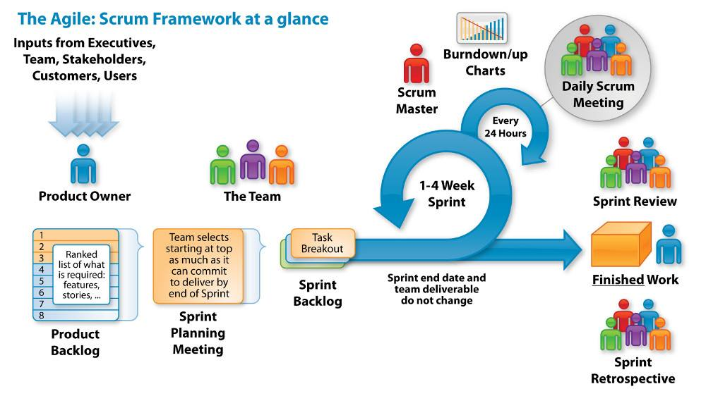
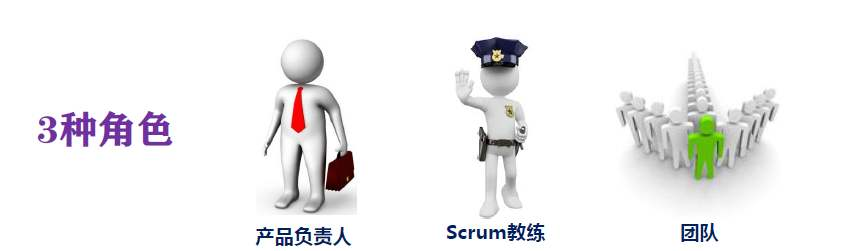

# Scrum

## 什么是Scrum？
1995年，Ken Schwaber和Jeff Sutherland提出了Scrum方法并且在OOPSLA工作坊中进行了初步的实践。

Scrum 是一个框架，在此框架中人们可以解决复杂的自适应难题，同时也能高效并创造性地交付可能最高价值的产品。

  

实施Scrum对组织和项目的好处：

更高的生产力和更低的成本。
员工的参与度与工作满意度增强。
更快的产品上市时间。
更高的质量。
项目干系人的满意度提升。
Scrum框架
从整体来说，SCRUM这个框架里面包含了这几个核心的要素，就是我们说的3355。

三种角色：

Product Owner
Scrum Master
Dev Team
三种工件：

产品待办列表 Product Backlog
Sprint待办列表 Sprint Backlog
产品增量 Product Increment
五种事件：

迭代 Sprint
迭代计划 Sprint Plan
每日站会 Daily standup meeting
评审会议 Sprint Review
迭代回顾 Retrospective
五种价值观：

勇气 Courage – 勇于承诺，履行承诺，敢于说不
开放 Open – 团队内所有信息对所有人开放
专注 Focus – 全身心都用到你承诺的工作上去
承诺 Commitment - 愿意对目标做出承诺
尊重 Respect – 每个人都有他独特的价值和经验
Scrum三大支柱
透明性 Transparency
过程或者项目的各个方面必须对结果负责人的透明的。

运用信息发射源，让这些关键信息，如产品待办事项列表，冲刺代办事项、障碍、风险和项目进展对所有的利益相关者是透明的。

检视 Inspection
团队根据项目目标定期检查他们的绩效和进展。

他们不断寻找问题和计划的偏离。

适应 Adaptation
基于观察期间的检查，采取必要的变更流程，以避免问题再次发生，提供项目交付成功率。
三种角色
Scrum团队由5~9个团队成员组成。有三种类型角色：

产品负责人 Product Owner
Scrum Master
开发团队 Dev Team

  

Product Owner
产品负责人的职责是将开发团队开发的产品价值最大化。（产品负责人是一个人，而不是一个委员会。）

清晰地表述产品待办列表项；
对产品待办列表项进行排序，使其最好地实现目标和使命；
优化开发团队所执行工作的价值；
确保产品待办列表对所有人是可见、透明和清晰的，同时显示 Scrum 团队下一步要做的工作。
确保开发团队对产品待办列表项有足够深的了解。
Scrum Master
Scrum Master负责确保所有人都能正确地理解并实施Scrum。因此Scrum Master要确保Scrum团队遵循Scrum的理论、实践和规则。

促进团队的工作
帮助团队熟悉与掌握 Scrum 价值观与框架
帮助团队排除影响生产力的障碍
保护团队不受打扰
Scrum Master 服务于产品负责人
Scrum Master 以各种方式服务于产品负责人，包括：

确保 Scrum 团队中的每个人都尽可能地理解目标、范围和产品域；
找到有效管理产品待办列表的技巧；
帮助 Scrum 团队理解为何需要清晰且简明的产品待办列表项；
理解在经验主义的环境中的产品规划；
确保产品负责人懂得如何来安排产品待办列表使其达到最大化价值；
理解并实践敏捷性；
当被请求或需要时，引导 Scrum 事件。
Scrum Master 服务于开发团队
Scrum Master 以各种方式服务于开发团队，包括：

作为教练在自组织和跨职能方面给予开发团队以指导；
帮助开发团队创造高价值的产品；
移除开发团队工作进展中的障碍；
按被请求或需要时， 引导 Scrum 事件；
在 Scrum 还未完全采纳和理解的组织环境中，作为教练指导开发团队。
Scrum Master 服务于组织
Scrum Master 以各种方式服务于组织，包括：

带领并作为教练指导组织采纳 Scrum；
在组织范围内规划 Scrum 的实施；
帮助员工和利益攸关者理解并实施 Scrum 和经验导向的产品开发；
引发能够提升 Scrum 团队生产率的改变；
与其他 Scrum Master 一起工作，增强组织中 Scrum 应用的有效性。
Dev Team
开发团队包含各种专业人员，负责在每个 Sprint 结束时交付潜在可发布并且“完成”的产品增量。 在 Sprint 评审会议上，一个“完成”增量是必需的。只有开发团队成员才能创建增量。

开发团队具有下列特点：

他们是自组织的。没有人（即使是 Scrum Master）有权告诉开发团队应该如何把产品
待办列表变成潜在可发布的功能增量；
开发团队是跨职能的团队，团队作为一个整体， 拥有创建产品增量所需的全部技能；
Scrum 不认可开发团队成员的任何头衔，不管其承担何种工作（他们都叫开发人员）。
Scrum 不认可开发团队中所谓的“子团队”，无论其需要处理的领域是诸如测试、架构、运维或业务分析；
开发团队中的每个成员也许有特长和专注的领域，但是责任属于整个开发团队。
“猪”与“鸡”的寓言
猪与鸡在散步，
鸡：“我们一起开家餐馆吧？”
猪：“好的，餐馆起个什么名字呢？”
鸡：“火腿和蛋！”
猪：“我不和你一起开餐馆了。因为我得全身心付出，而你仅仅是牵涉入内。”

区分两类人：对承担项目的人赋予权力，使其完成必要工作，确保项目成功；无责任人员则无权对项目施加不必要的干涉。

敏捷项目的运作中，敏捷教练要保护团队不受外部干扰。如果项目中的伸手过界的“鸡”太多，则项目很难走向成功。

三种工件
Scrum 的工件以不同的方式表现工作任务和价值，可以用来提供透明以及检视和适应的机会。 Scrum 所定义的工件是特别地设计的，是为了给关键信息提供最大透明化，因此每个人对工件都需要有相同的理解。

产品待办列表 Product Backlog
Sprint待办列表 Sprint Backlog
产品增量 Product Increment
Product Backlog
产品待办列表Product Backlog即产品视角的需求清单。

由 Product Owner 负责维护，包括增删及优先级。
用户故事是其中一种最佳实践。
每项需求都需要描述其外部价值。
Sprint Backlog
Sprint 待办事项 Sprint Backlog即此次冲刺周期内规划要完成的内容。

来源于Product Backlog。
由团队评估和选择Product Backlog中哪些放入Sprint Backlog。
团队需要一起定义“完成”的标准。
Product Increment
可交付产品增量Increment即冲刺结束后可对外发布的产品功能增量部分。

需要关注其是可工作的软件功能增量。
需要要在Scrum Review会议上进行演示。
五种事件
迭代 Sprint
Sprint（冲刺、迭代）是一个特殊的事件，或者说其一个容器事件。后续四个事件包含在其中。

2-4周
固定周期，固定时间开始，固定时间结束
时间盒是其一个重要的概念
迭代计划 Sprint Plan
Sprint规划会的核心议题是下一次冲刺要实现的目标和范围。

确定 Sprint 的目标
对产品backlog 中 item 进行估算，以作为是否放入下期的参考。
对于需求不清楚的 item，请 Product Owner 说明。
输入是 Product backlog
输出是 Sprint backlog
每日站会 Daily standup meeting
站会的目标是促进信息在团队内共享与透明。

回答3个问题
本次会议之前，我做了哪些事情？
本次会议之后，我准备做什么事情？
目前我是否碰到障碍，阻碍我达成目标？
每天15分钟
不是深入的问题讨论
每天固定时间召开
评审会议 Sprint Review
Sprint 评审会在冲刺末期召开，检查本期的成果。

团队全体参与
邀请相关干系人参与
2-4小时
Product Owner可以拒绝接收成果
迭代回顾 Retrospective
团队一起复盘本次冲刺的过程，总结经验与教训，并形成切实可行的改进清单。

Sprint评审会结束后召开
时间2-4小时
团队全体参与

[1] Ken Schwaber、Jeff Sutherland.《Scrum指南》
[2] https://blog.csdn.net/qq1620657419/article/details/106660342