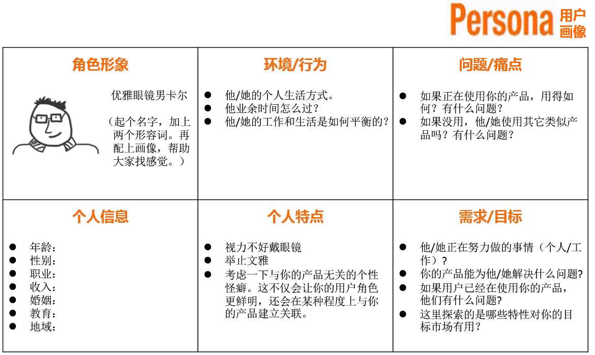
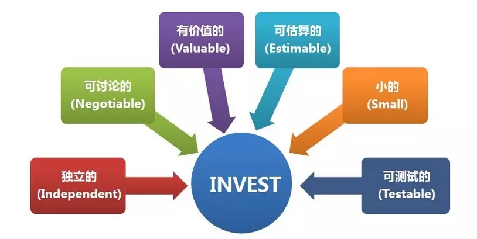
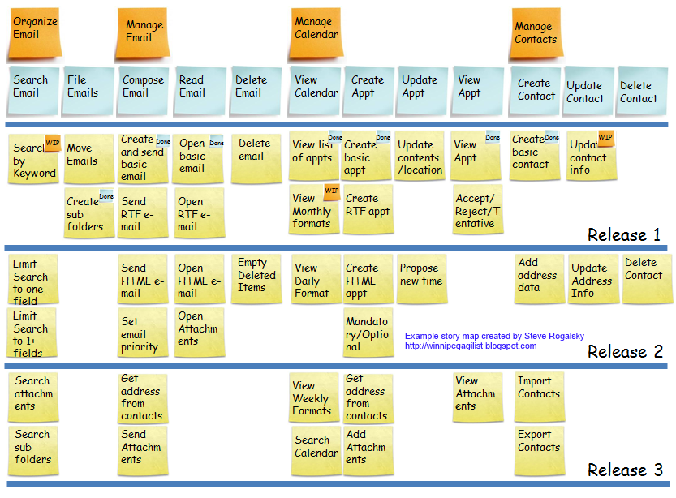

# story

从产品愿景到用户故事地图

## 产品愿景
明确产品愿景就是明确商业目的，一方面可以帮助团队统一思想，同时也可以确认问题域范围。

产品愿景模板
   - 为了 [目标用户],
   - 他们的 [需要和机会],
   - 这个 [产品名称],
   - 是一个 [产品类型]，
   - 它可以 [关键优点和使用理由]，
   - 而不像 [同类竞争者]，
   - 我们产品的 [差异化声明]。

## 用户画像
在有了大致的产品愿景之后，第二步就是确认产品的用户画像。 用户画像是一种勾画目标用户、了解用户诉求与设计方向的有效工具。

  

用户模板

## 用户故事
用户故事（user story）是个用来确定用户和描述用户需求的基本呈现单位。一个好的用户故事包括三个要素：

1. 用户角色（Who）：谁要使用这个功能；
2. 活动（What）：需要完成什么样的功能；
3. 商业价值（Why）：为什么需要这个功能，这个功能带来什么样的价值。

基于这三要素可以构建出一个简单的用户故事模板。

- 作为一名【角色】，
- 我想要【商业活动】，
- 以便于【商业价值】。

## 3C原则
用户故事的描述信息以传统的手写方式写在纸质卡片上，所以Ron Jeffries(2001)对这三个方面称为3C：卡片(Card)、对话(Conversation)和确认(Confirmation)。

卡片（Card）
用户故事一般写在小的计记事卡片上。卡片上可能会写故事的简短描述，工作量估算等。

交谈（Conversation）
用于在计划或估算时引发关于故事细节的对话。

确认（Confirmation）
将细节以验收测试的方式来确认故事完整性和正确性。

## INVEST原则
好的用户故事除了格式规范，要素完整外，还应该遵循INVEST原则：Idependent（独立的）、Negotiable（可协商的）、Valuable（有价值的）、Estimatable（可估算的）、Small（小的）、Testable（可测试的）。

  

故事的优先级 MoSCoW法则
- Must Have 必须有的
- Should Have 可能有的
- Could Have 可以有的
- Won’t have this time 这次不会有的

## 用户故事地图
用户故事地图（User Story Mapping）是 Jeff Patton 在《用户故事地图》一书中提出的。他所提出的用户故事地图的方法主要用于解决敏捷需求分析过程中的问题。

  

用户故事地图可以解决以下问题：

1）让你更容易看清backlog的全貌。
2）为新功能筛选（grooming）和划定优先级提供了更好的工具，帮助你做出决策。
3）便于使用静默头脑风暴模式和其它协作方式来产生用户故事。
4）帮助你更好地进行迭代增量开发，同时确保早期发布可以验证整体框架的解决方案。
5）为传统的项目计划提供了一个更好的替代工具。
6）有助于激发讨论和管理项目范围。
7）允许你从多个维度进行项目规划，并确保不同的想法都可以得到采纳。