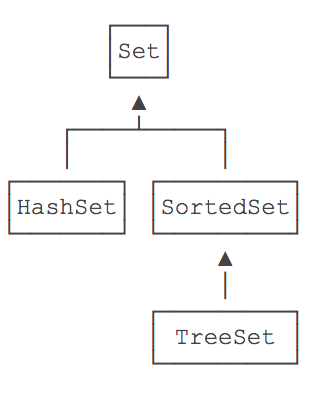

# 集合

Java标准库自带的java.util包提供了集合类：Collection

Java的java.util包主要提供了以下三种类型的集合:
- List: 有序列表的集合
- Set: 没有重复元素
- Map: 通过键值查找的映射表集合

集合设计的特点
1. 实现了接口和实现类相分享 如有序表的接口是List 实现类为ArrayList LinkedList
2. 支持泛型 可以在一集合中限定只放一个数据类型

Java访问集合总是通过统一的方式——迭代器（Iterator）来实现

## List
使用最多为的ArrayList

- ArrayList添加指定索引值时,自动移动
- 添加元素,数组满时,会创建更大新数组

接口方法
- add(e)
- add(index, e)
- remove(index)
- remove(e)
- get(index)
- size()

```java
//创建list
List<Integer> list = List.of(1, 2, 5);

//遍历
List<String> list = List.of("apple", "pear", "banana");
        for (String s : list) {
            System.out.println(s);
        }

//转换
Object[] array = list.toArray();

Integer[] array = list.toArray(new Integer[list.size()]);

Integer[] array = list.toArray(Integer[]::new);
```

> 通过Iterator遍历List永远是最高效的方式

## map

> Map中不存在重复的key，因为放入相同的key，只会把原有的key-value对应的value给替换掉。
> 遍历Map时，不可假设输出的key是有序的！

```java

//创建map
Student s = new Student("Xiao Ming", 99);
Map<String, Student> map = new HashMap<>();

map.put("Xiao Ming", s); // 将"Xiao Ming"和Student实例映射并关联

Student target = map.get("Xiao Ming"); // 通过key查找并返回映射的Student实例

//遍历key
Map<String, Integer> map = new HashMap<>();
map.put("apple", 123);
map.put("pear", 456);
map.put("banana", 789);
for (String key : map.keySet()) {
    Integer value = map.get(key);
    System.out.println(key + " = " + value);
}

//遍历key-value
Map<String, Integer> map = new HashMap<>();
map.put("apple", 123);
map.put("pear", 456);
map.put("banana", 789);
for (Map.Entry<String, Integer> entry : map.entrySet()) {
    String key = entry.getKey();
    Integer value = entry.getValue();
    System.out.println(key + " = " + value);
}

```

### hashmap

要正确使用HashMap，作为key的类必须正确覆写equals()和hashCode()方法；

一个类如果覆写了equals()，就必须覆写hashCode()，并且覆写规则是：
- 如果equals()返回true，则hashCode()返回值必须相等；
- 如果equals()返回false，则hashCode()返回值尽量不要相等。

实现hashCode()方法可以通过Objects.hashCode()辅助方法实现。


### EnumMap

如果Map的key是enum类型，推荐使用EnumMap，既保证速度，也不浪费空间。

使用EnumMap的时候，根据面向抽象编程的原则，应持有Map接口
```java
Map<DayOfWeek, String> map = new EnumMap<>(DayOfWeek.class);
        map.put(DayOfWeek.MONDAY, "星期一");
        map.put(DayOfWeek.TUESDAY, "星期二");
        map.put(DayOfWeek.WEDNESDAY, "星期三");
        map.put(DayOfWeek.THURSDAY, "星期四");
        map.put(DayOfWeek.FRIDAY, "星期五");
        map.put(DayOfWeek.SATURDAY, "星期六");
        map.put(DayOfWeek.SUNDAY, "星期日");
        System.out.println(map);
        System.out.println(map.get(DayOfWeek.MONDAY));
    }
```

### TreeMap

接口是SortedMap TreeMap是实现类

- SortedMap在遍历时严格按照Key的顺序遍历，最常用的实现类是TreeMap；
- 作为SortedMap的Key必须实现Comparable接口，或者传入Comparator；
- 要严格按照compare()规范实现比较逻辑，否则，TreeMap将不能正常工作


### Properties

读取配置文件
```java
String f = "setting.properties";
Properties props = new Properties();
props.load(new java.io.FileInputStream(f));

String filepath = props.getProperty("last_open_file");
String interval = props.getProperty("auto_save_interval", "120");

//写入配置
Properties props = new Properties();
props.setProperty("url", "http://www.liaoxuefeng.com");
props.setProperty("language", "Java");
props.store(new FileOutputStream("C:\\conf\\setting.properties"), "这是写入的properties注释");

//中文正确读取
Properties props = new Properties();
props.load(new FileReader("settings.properties", StandardCharsets.UTF_8));
```

用Properties读取配置文件，一共有三步：
- 创建Properties实例；
- 调用load()读取文件；
- 调用getProperty()获取配置。

Java集合库提供的Properties用于读写配置文件.properties。.properties文件可以使用UTF-8编码。

可以从文件系统、classpath或其他任何地方读取.properties文件。

读写Properties时，注意仅使用getProperty()和setProperty()方法，不要调用继承而来的get()和put()等方法。

## set

存储不重复的元素集合

- 将元素添加进Set<E>：boolean add(E e)
- 将元素从Set<E>删除：boolean remove(Object e)
- 判断是否包含元素：boolean contains(Object e)

最常用的Set实现类是HashSet，实际上，HashSet仅仅是对HashMap的一个简单封装

Set接口并不保证有序，而SortedSet接口则保证元素是有序的：
- HashSet是无序的，因为它实现了Set接口，并没有实现SortedSet接口；
- TreeSet是有序的，因为它实现了SortedSet接口
  
  

Set用于存储不重复的元素集合：
- 放入HashSet的元素与作为HashMap的key要求相同；
- 放入TreeSet的元素与作为TreeMap的Key要求相同；
利用Set可以去除重复元素；
- 遍历SortedSet按照元素的排序顺序遍历，也可以自定义排序算法。

## queue
Queue实际上是实现了一个先进先出（FIFO：First In First Out）的有序表
要避免把null添加到队列

它和List的区别在于，List可以在任意位置添加和删除元素，而Queue只有两个操作：
- 把元素添加到队列末尾；
- 从队列头部取出元素。

队列接口Queue定义了以下几个方法：
- int size()：获取队列长度；
- boolean add(E)/boolean offer(E)：添加元素到队尾；
- E remove()/E poll()：获取队首元素并从队列中删除；
- E element()/E peek()：获取队首元素但并不从队列中删除

 |  	|throw Exception | 返回false或null |
 | -- | -- |-- |
 | 添加元素到队尾 | add(E e) | boolean offer(E e) |
 | 取队首元素并删除 | E remove() | E poll() |
 | 取队首元素但不删除 | E element() | E peek() |

 ## PriorityQueue

PriorityQueue实现了一个优先队列：从队首获取元素时，总是获取优先级最高的元素。

PriorityQueue默认按元素比较的顺序排序（必须实现Comparable接口），也可以通过Comparator自定义排序算法（元素就不必实现Comparable接口）。

## Deque

允许两头都进，两头都出，这种队列叫双端队列（Double Ended Queue），学名Deque

Java集合提供了接口Deque来实现一个双端队列，它的功能是：

- 既可以添加到队尾，也可以添加到队首；
- 既可以从队首获取，又可以从队尾获取。


Deque实现了一个双端队列（Double Ended Queue），它可以：

- 将元素添加到队尾或队首：addLast()/offerLast()/addFirst()/offerFirst()；
- 从队首／队尾获取元素并删除：removeFirst()/pollFirst()/removeLast()/pollLast()；
- 从队首／队尾获取元素但不删除：getFirst()/peekFirst()/getLast()/peekLast()；
- 总是调用xxxFirst()/xxxLast()以便与Queue的方法区分开；
- 避免把null添加到队列。

## stack

栈（Stack）是一种后进先出（LIFO）的数据结构，操作栈的元素的方法有：
- 把元素压栈：push(E)；
- 把栈顶的元素“弹出”：pop(E)；
- 取栈顶元素但不弹出：peek(E)。
在Java中，我们用Deque可以实现Stack的功能，注意只调用push()/pop()/peek()方法，避免调用Deque的其他方法。

最后，不要使用遗留类Stack

## itertor

如果我们自己编写了一个集合类，想要使用for each循环，只需满足以下条件：

- 集合类实现Iterable接口，该接口要求返回一个Iterator对象；
- 用Iterator对象迭代集合内部数据。

Iterator是一种抽象的数据访问模型。使用Iterator模式进行迭代的好处有：

对任何集合都采用同一种访问模型；
调用者对集合内部结构一无所知；
集合类返回的Iterator对象知道如何迭代。
Java提供了标准的迭代器模型，即集合类实现java.util.Iterable接口，返回java.util.Iterator实例。


## Collections

创建空集合
Collections提供了一系列方法来创建空集合：

- 创建空List：List<T> emptyList()
- 创建空Map：Map<K, V> emptyMap()
- 创建空Set：Set<T> emptySet()

```java
List<String> list1 = List.of();
List<String> list2 = Collections.emptyList();
```

创建单元素集合
Collections提供了一系列方法来创建一个单元素集合：

- 创建一个元素的List：List<T> singletonList(T o)
- 创建一个元素的Map：Map<K, V> singletonMap(K key, V value)
- 创建一个元素的Set：Set<T> singleton(T o)

```java
List<String> list1 = List.of("apple");
List<String> list2 = Collections.singletonList("apple");
```

排序
```java
Collections.sort(list);
```

洗牌算法 随机打乱
```java
Collections.shuffle(list);
```

可变集合
Collections还提供了一组方法把可变集合封装成不可变集合：

- 封装成不可变List：List<T> unmodifiableList(List<? extends T> list)
- 封装成不可变Set：Set<T> unmodifiableSet(Set<? extends T> set)
- 封装成不可变Map：Map<K, V> unmodifiableMap(Map<? extends K, ? extends V> m)

```java
List<String> immutable = Collections.unmodifiableList(mutable);
```

