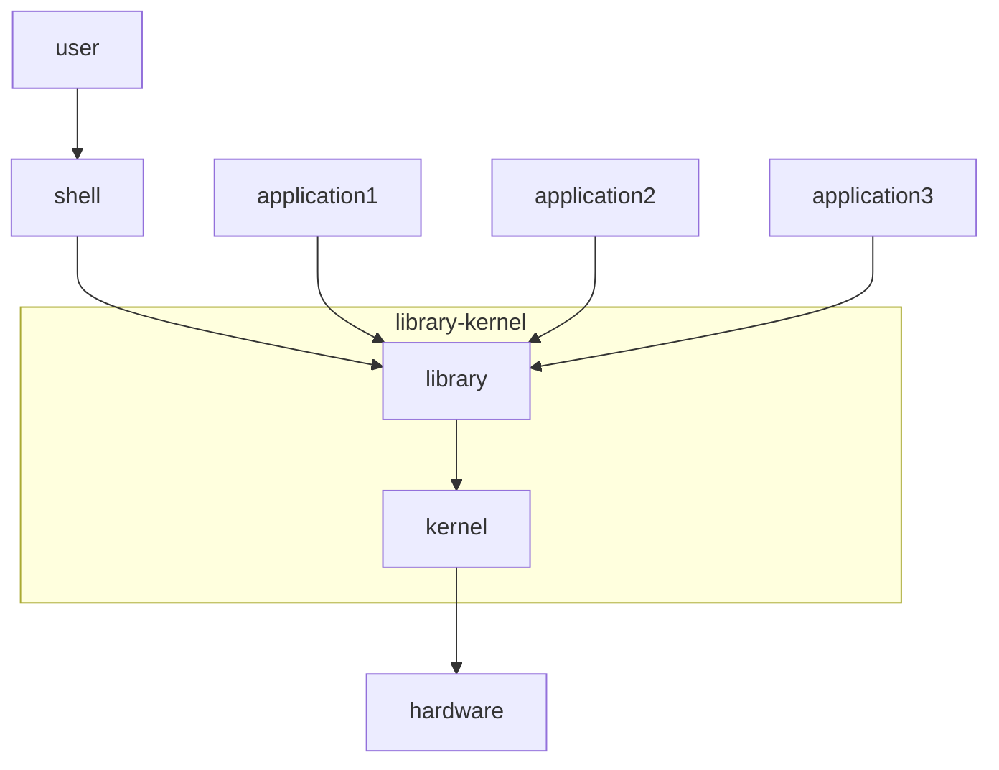

# Linux

## 过程式编程语言
- 顺序执行
- 循环执行
- 选择执行

## 来历
Unix 最早命名unicx
开发语言从汇编到C语言

GNU：GNU is not unix
GPL: General Public License
FSF: Free Software foundation

## OS的接口有两类
- GUI： Graphic User Interface
  - GNOME: c, gtk
  - KDE: c++, qt
- CLI: Command Line Interface
  - bash
  - zsh
  - sh
  - csh
  - ksh
  - tcsh

## 操作系统的功能
- 驱动程序
- 进程管理
- 安全
- 网络功能
- 内存管理
- 文件系统
- ...

## system call与库
API：application Program Interface 程序员面对的编程接口
    - POSIX： Portable  Operating System API的兼容接口，兼容windows/linux
ABI: aplication Binary Interface 程序应用者面对运行程序的接口

### GNU
源码： 编译成为二进制格式
gcc, glibc, vi, linux
发行版：数百种之多
- debian
  - ubuntu
  - knopix
- Slackware
  - SUSE
    - SLES
    - openSUSE
- RedHat
  - RedHat Enterprice Linux：RHEL
    - CentOS: Community Enterprice OS
  - Fedora Core
- Gentoo
- ArchLinux

系统有版本，程序也有自己的版本号，发行版也有自己的版本号

### 开源协议 GPL，BSD，apache，MIT

- BSD 保留原BSD协议，不可以用原作者做推广
- MIT 同BSD
- Apache 保留原Apache协议，增加修改说明，新发布包含notice
  - ASF： Apache Software Foundation
- GPL General Public License  软件使用GPL协议的软件产品，也必须采用GPL协议，即必须开源和免费 传染性协议
- LGPL Lesser GPL 为类库使用 只是调用库的话，可不用开源

双线授权
- community：社区版 遵循开源协定
- enterprice: 商业授权

## Linux基础
### CPU架构
- x86
- x64(amd64)
- m68000,m68k
- arm
- ultrasparc
- power aix
- powerpc, ppc
- MIPS
- alpha hp-ux
- kali 扫描 攻击
- ...
  

### 移植 portable
交叉编译：一个平台编译另一个台可运行的代码

## 程序管理
程序的组成部分
- 二进制程序 可执行文件
- 配置文件 可被查看其内容的文件
- 库文件 可执行文件，不能独立运行，只能被调用
- 帮助文件 可被查看其内容的文件

x.y,z

程序包管理器：
x:
    程序的组成文件打包一个或有限的几个文件
    安装
    卸载
    查询
Debian：dpkg/deb, apt-get
RedHat: rpm, yum --> dnf, yum存在并发问题
S.u.S.E: rpm, zypper
ArchLinux： port
Gentoo： 
LFS： Linux From Scratch 从0构建linux 

## 安装Linux
虚拟机：Linux 
    计算机：CPU， 内存， IO
虚拟化软件程序
- vmare workstation
- virtualbox   

Centos的镜像站点
- mirrors.aliyun.com
- mirrors.163.com
- mirrors.sohu.com

 ## 终端 terminal
用户界面：
- GUI：GNome，KDE
- CLI：bash, zsh, sh ,csh, tcsh, ksh 
  - 命令行接口 prompt

## 终端设备
键盘+鼠标
多任务，多用户
物理终端，控制台：console
虚拟终端：6个 tty 
图形终端 centos6 ctrl+alt+f7 centos7 : 在启动图形终端的虚拟终端 
串行终端 ttys
伪终端 pty

注意：在启动设备之后，在其上关联的一个用户接口程序，即可实现与用户交互
 
启动GUI（图形界面）：在某一虚拟终端接口运行命令：startx &

### Linux架构

## 推荐书籍
- 《穿越计算机的迷雾》
- 《量子物理史话》

