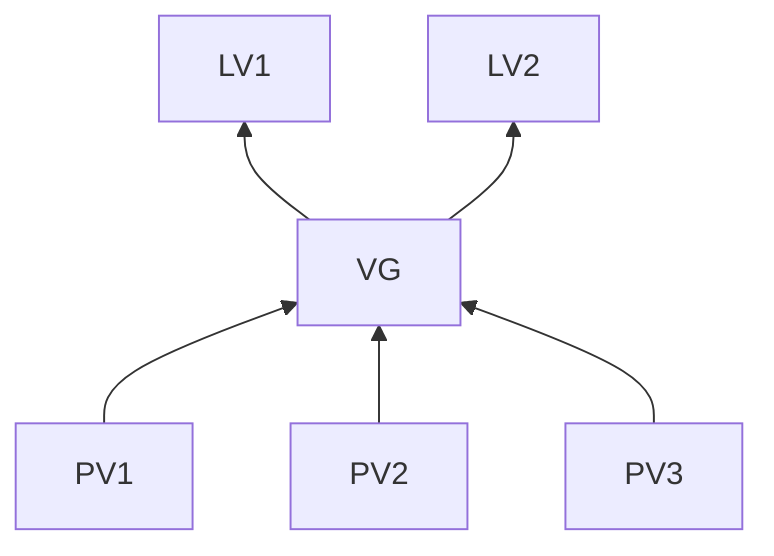

# LVM2

LVM: Logical Volume Manager Version:2
dm: device mapper : 将一个或多个底层设备组织成一个单一设备 
- /dev/dm-#
- /dev/centos/root -> ../dm-0
- /dev/mapper/centos-root -> ../dm-0

- PV:physical volume
- VG: volume group
- LV: logic volume 边界动态扩展或收缩,快照
- PE: physical Extenct 512KB 1M 2M 4M 8M.. 
- LE:PE与LE大小相同且一一对应

1. 物理卷（PV）被由大小等同的基本单元PE组成 
2. 逻辑卷（LV）被由大小等同的基本单元LE组成 
3. PE与LE大小相同且一一对应
4.  一个卷组（VG）由一个或多个物理卷（PV）组成 
5. 逻辑卷可以比物理卷更大/更小，因为逻辑卷的单元（LE）个数可以比物理卷的单元（PE）个数更多/更小，又由于PE的大小等于LE的大小，这样就可以改变分区的大小

## PV管理工具
- pvs 简要PV显示信息
- pvcreate 创建pv

## VG管理工具
- vgs
- vgdisplay
- vgcreate
- vgextend
- vgreduce
- vgremove

## LV管理工具
- lvs
- lvdisplay
- lvcreate -L #[mMgGtT] -n name VolumeGroup
- lvremove /dev/VG_NAME/LV_NAME

## 扩展逻辑卷
- lvextend -L [+]#[mMgGtT] /dev/VG_NAME/LV_NAME
- resize2fs /dev/VG_NAME/LV_NAME

## 缩减逻辑卷
- umount  /dev/VG_NAME/LV_NAME
- e2fsck -f /dev/VG_NAME/LV_NAME
- resize2fs /dev/VG_NAME/LV_NAME #[mMgGtT]
- lvreduce -L [-]#[mMgGtT] /dev/VG_NAME/LV_NAME
- mount
  
## 快照:snapshot
- lvcreate -l #[mMgGtT]  -p -r -s -n snapshot_lv_name original_lv_name

发生变化时,从原卷复制一份到快照卷
从快照卷访问没有发生变化的文件从原卷访问

防止原卷损坏要做全量备份,与从原件做增量备份或差异备份

