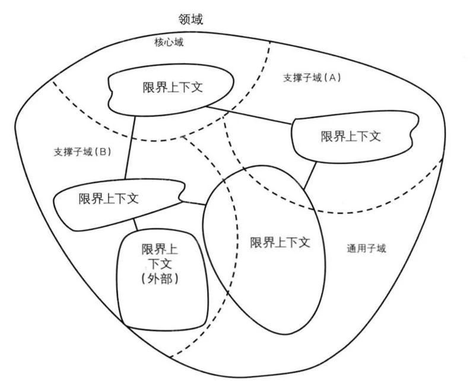

# 领域驱动设计

2004 年 Eric Evans 发表《Domain-Driven Design –Tackling Complexity in the Heart of Software》 （领域驱动设计 ）简称 Evans DDD。但在软件开发领域一直都是雷声大，雨点小，领域驱动设计核心思想是通过领域驱动设计方法定义领域模型，从而确定业务和应用边界，保证业务模型与代码模型的一致性。这几年之所以开始火起来，主要功劳要归功于队友“微服务”，领域驱动设计与微服务架构天生匹配。

领域驱动设计（DDD）是一种处理高度复杂域的设计思想，试图分离技术实现的复杂性，围绕业务概念构建领域模型来控制业务的复杂性，以解决软件难以理解，难以演化等问题。团队利用它可以成功的开发复杂业务软件系统，在系统变大时仍能保持敏捷性。

领域驱动设计分为两个阶段：

1. 以一种领域专家、设计人员、开发人员都能理解的通用语言作为相互交流的工具，在交流的过程中发现领域概念，然后将这些概念设计成一个领域模型；

2. 由领域模型驱动软件设计，用代码来实现该领域模型。

领域驱动设计的核心诉求是让业务架构和系统架构形成绑定关系，当我们去响应业务变化调整业务架构时，系统架构的改变也会随之发生。在领域驱动设计中业务架构的梳理和系统架构的梳理是同步进行的，其结果是设计出的业务上下文和系统模块结构是绑定的。同时技术架构也是解耦的，可以根据划分出来的业务上下文的系统架构选择最合适的实现技术。

领域驱动设计包括战略设计和战术设计两个部分。战略设计主要关注按领域定义，在限界上下文内形成统一语言，提升业务和技术的沟通效率； 战术设计主要关注领域设计在落地时与设计模型及实现模型的差异性，减小业务和技术之间的鸿沟。（本文对 DDD 知识点不做详述，如需了解或学习，请查阅《领域驱动设计：软件核心复杂性应对之道》和《实现领域驱动》）。

领域驱动设计可能会给你带来以下收获：

1、领域驱动设计是一套完整而系统的设计方法，它能带给你从战略设计到战术设计的规范过程，使得你的设计思路能够更加清晰，设计过程更加规范。

2、领域驱动设计尤其善于处理与领域相关的高复杂度业务的产品研发，通过它可以为你的产品建立一个核心而稳定的领域模型内核，有利于领域知识的传递与传承。

3、领域驱动设计强调团队与领域专家的合作，能够帮助团队建立一个沟通良好的团队组织，构建一致的架构体系。 领域驱动设计强调对架构与模型的精心打磨，尤其善于处理系统架构的演进设计。

4、领域驱动设计的思想、原则与模式有助于提高团队成员的架构设计能力。

5、领域驱动设计与微服务架构天生匹配，无论是在新项目中设计微服务架构，还是将系统从单体架构演进到微服务设计，都可以遵循领域驱动设计的架构原则。

领域驱动设计中领域的定义：一个领域本质上可以理解为就是一个问题域，只要是同一个领域，那问题域就相同。所以只要我们确定了系统所属的领域，那这个系统的核心业务，即要解决的关键问题、问题的范围边界就基本确定了。领域的本质是问题域，问题域可能根据需要逐层细分，因此领域可分解为子域，子域或可继续分为子子域。。。

在领域驱动设计中根据重要性与功能属性将领域分为三类子域，分别是：核心子域、支撑子域和通用子域。决定产品和企业独特竞争力的子域是核心子域，它是业务成功的主要因素和企业的核心竞争力。没有个性化的诉求，属于通用功能的子域是通用子域，如登陆认证。 还有一种所提供的功能是必须的，但不是通用也不是企业核心竞争力的子域是支撑子域，如单证。

  

## DDD 战术设计

相关设计和开发规范

