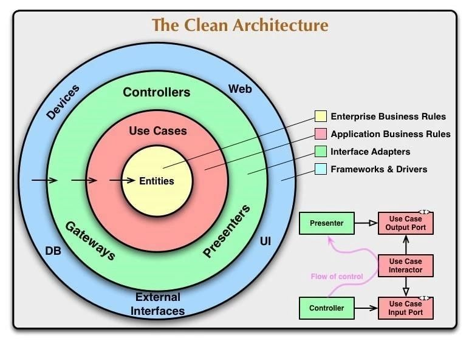
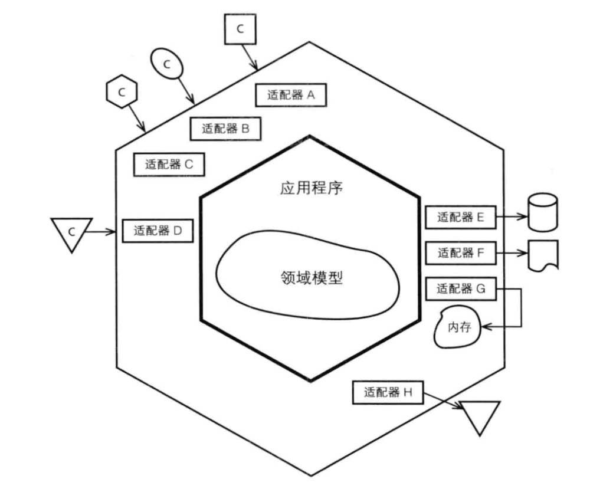
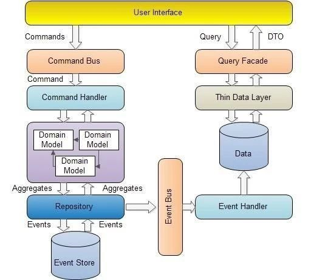
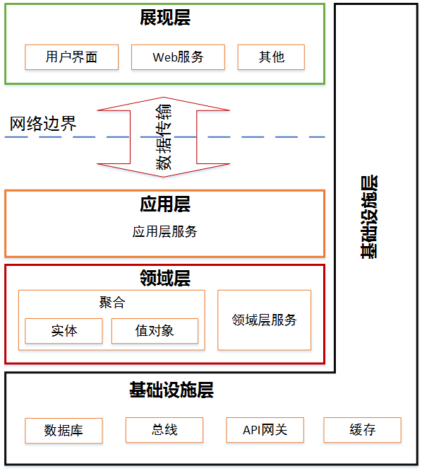
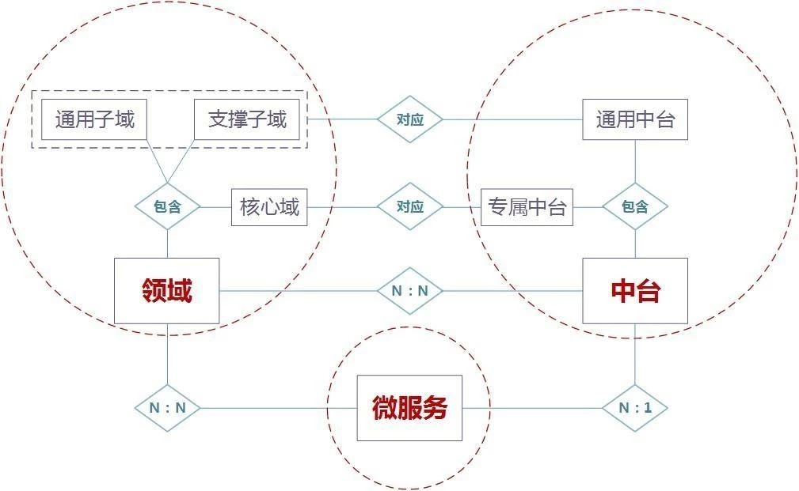
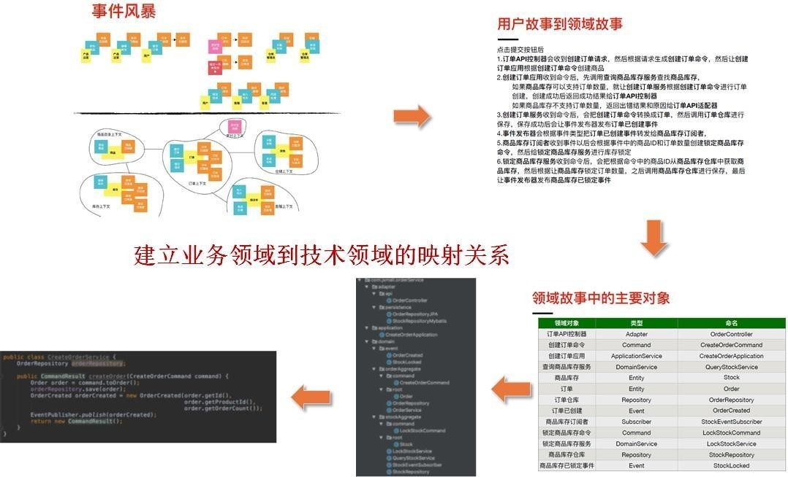
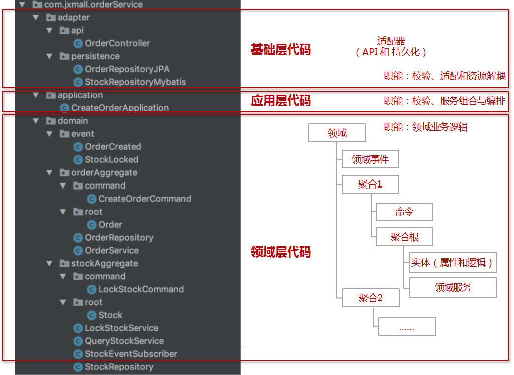
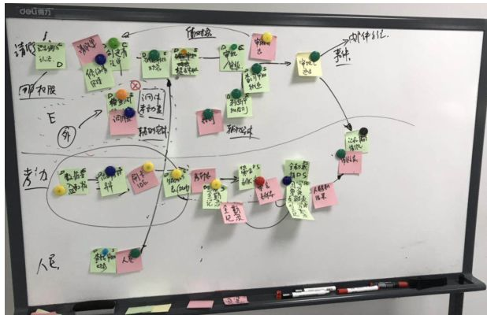
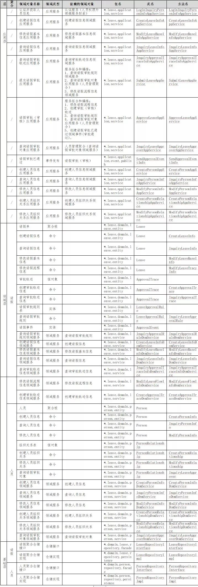
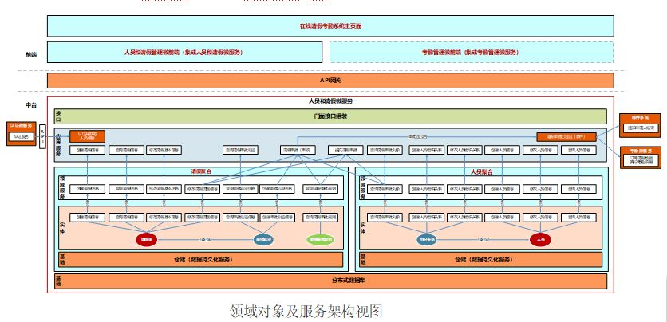

# 如何设计微服务

> 设计原则千万条，高内聚低耦合第一条，架构设计不规范，开发运维两行泪！

## 微服务架构模型
### 整洁架构（又名洋葱架构）
整洁架构最主要原则是依赖原则，它定义了各层的依赖关系，越往里，依赖越低，代码级别越高。外圆代码依赖只能指向内圆，内圆不知道外圆的任何事情。一般来说，外圆的声明（包括方法、类、变量）不能被内圆引用。同样的，外圆使用的数据格式也不能被内圆使用。

  

### 六边形架构（又名端口适配器架构）
核心理念是：应用是通过端口与外部进行交互的，这也是微服务架构下 API 网关盛行的主要原因。六边形架构中，内部业务逻辑（应用层和领域模型）与外部资源（APP，WEB 应用以及数据库资源等）完全隔离，仅通过适配器进行交互。它解决了业务逻辑与用户界面的代码交错的主要问题，从而可以很好的实现前后端分离。

  

### CQRS（命令与查询职责分离）
CQRS 就是读写分离，读写分离的主要目的是为了提高查询性能，同时达到读、写解耦。而 DDD 和 CQRS 结合，可以分别对读和写建模。

  

### 领域驱动设计分层架构

分层架构的一个重要原则是每层只能与位于其下方的层发生依赖。

1. 开发人员只关注整个架构中的某一层。 
2. 很容易的用新的方法来替换原有层次的方法。
3. 降低层与层之间的依赖。 
4. 有利于标准化。 
5. 利于各层逻辑的复用。

要保持程序分层架构的优点，就必须坚持层间的松耦合关系。设计程序时，应先划分出可能的层次，以及此层次提供的接口和需要的接口。设计某层时，应尽量保持层间的隔离，仅使用下层提供的接口。

  

## DDD（领域驱动设计）分层架构

DDD 分层架构各层定义与职能：

展现层：它负责向用户显示信息和解释用户命令，完成前端界面逻辑。这里的用户不一定是使用用户界面的人，也可以是另一个计算机系统。

应用层：它是很薄的一层，负责展现层与领域层之间的协调，也是与其它系统应用层进行交互的必要渠道。应用层要尽量简单，不包含业务规则或者知识，不保留业务对象的状态，只保留有应用任务的进度状态，更注重流程性的东西。它只为领域层中的领域对象协调任务，分配工作，使它们互相协作。

领域层：它是业务软件的核心所在，包含了业务所涉及的领域对象（实体、值对象）、领域服务以及它们之间的关系，负责表达业务概念、业务状态信息以及业务规则，具体表现形式就是领域模型。领域驱动设计提倡富领域模型，即尽量将业务逻辑归属到领域对象上，实在无法归属的部分则以领域服务的形式进行定义。

基础设施层：它向其他层提供通用的技术能力，为应用层传递消息（API 网关等），为领域层提供持久化机制（如数据库资源）等。

领域驱动设计主要关注：业务领域，划分领域边界；构建通用语言，高效沟通；对业务进行抽象，建立领域模型；维持业务和代码的逻辑一致性。

微服务主要关注：运行时进程间通信，能够容错和故障隔离；去中心化管理数据和去中心化治理；服务可以独立的开发、测试、构建和部署，按业务组织全功能团队；高内聚低耦合，职责单一。

如果你的业务焦点在领域和领域逻辑，那么你就可以选择 DDD 进行微服务架构设计。

  

中台、领域以及微服务

微服务是技术实现和部署的范畴，实现领域或中台的业务逻辑，为前台应用提供服务。领域根据限界上下文可以设计为多个微服务，而如果限界上下文过大，一个微服务也可能会包含多个子领域。

中台是由多个业务条线的共同需求所构成，是需要共享的业务功能和服务单元的集合，一个中台可由一个微服务来实现，也可根据领域驱动设计和微服务拆分原则细分为多个微服务，多个微服务功能集合共同组成一个中台。

## 基于 DDD 的微服务设计方法

DDD 设计包括战略设计和战术设计两个部分。在战略设计阶段主要完成领域建模和服务地图。在战术设计阶段，通过聚合、实体、值对象以及不同层级的服务，完成微服务的建设和实施。通过 DDD 可以保证业务模型、系统模型、架构模型以及代码模型的一致。

本部分主要讨论领域设计方法，如对战术设计和开发方法感兴趣可查阅 DDD 战术设计相关资料。

DDD 领域设计过程包括产品愿景、场景分析、领域建模和服务地图阶段，也可根据需要裁剪不必要的阶段和参与角色。领域驱动设计一般经历 2-6 周的时间，领域模型设计完成后，即可投入微服务实施。

1、产品愿景

产品愿景是对产品的顶层价值设计，对产品目标用户、核心价值、差异化竞争点等策略层信息达成一致，避免产品在演进过程中偏离方向。

阶段输入：产品初衷、用户研究、竞品知识和差异性想法 。

参与角⾊：业务需求方、产品经理、开发组长和产品发起人。

阶段产出：电梯演讲画布。

2、场景分析

场景分析是针对核心用户及顶层服务的一种定性分析，从⽤户视角出发，探索问题域中的典型场景分析。同时也是从用户视角对问题域的探索，产出问题域中需要支撑的场景分类及典型场景，用以支撑领域建模阶段。

阶段输⼊：核⼼干系人和服务价值定位。

参与角色：产品经理、开发组长和测试组长。

阶段产出：场景分类清单。

3、领域建模

领域建模是通过对业务和问题域进⾏分析，建⽴领域模型，向上通过限界上下⽂指导微服务的边界设计，向下通过聚合指导实体的对象设计。领域建模主要采用事件风暴方法。

阶段输入：业务领域知识和场景分类清单。

参与角色：领域专家、架构师、产品经理、开发组长和测试组长。

阶段产出：聚合模型和限界上下⽂地图。

4、服务地图

服务地图是整个产品服务架构的体现。结合业务与技术因素，对服务的粒度、边界划分、集 成关系进⾏梳理，得到反映系统微服务层面设计的服务地图。

阶段输⼊：限界上下⽂地图。

参与角⾊：产品经理、开发组长、测试组长和产品发起人。

阶段产出：服务地图。

在进行服务地图设计时需要考虑以下要素：1. 围绕限界上下⽂边界。2. 考虑不同业务变化速度 / 相关度、发布频率。3. 考虑系统非功能性需求，如系统弹性伸缩要求、安全性要求和可⽤性要求。4. 考虑团队组织和沟通效率。5. 软件包限制。6. 技术和架构的异构。

通过 DDD 战略和战术全流程设计可建立业务架构与系统架构的一一映射，保证业务和代码模型的一致性。

  

## DDD 分层架构中的服务
前面我们谈到了 DDD 的分层架构，分层架构主要包括：展现层、应用层、领域层和基础层（参考图：DDD（领域驱动设计）分层架构），各层都有不同的服务，但由于各层职责不一样，服务目的和实现方式也存在差异。

1、应用层服务

应用层是很瘦的一层，其服务主要用来表述应用和用户行为。它主要负责服务的组合、编排和转发，负责处理业务用例的执行顺序以及结果的拼装，拼装完领域服务后以粗粒度的服务通过 API 网关向前台应用发布。通过这样一种方式，隐藏了领域层的复杂性及其内部实现机制。 应用层除了定义应用服务之外，在这层还可以进行安全认证，权限校验，持久化事务控制或向其他系统发送基于事件的消息通知。

2、领域层服务

领域层是较“胖”的一层，它实现了全部业务逻辑并且通过各种校验手段保证业务正确性。业务逻辑包括：业务流程、业务策略、业务规则、完整性约束等。 当领域中的某个操作过程或转换过程不是实体或值对象的职责时，便将该操作放在一个单独的服务接口中，这就是领域服务，领域服务是无状态的。

3、基础设施层服务
 
基础设施层服务位于基础设施层，根据依赖倒置原则，封装基础资源服务，实现资源层与应用层和领域层的调用依赖反转，为应用层和领域层提供基础资源服务（如数据库、缓存等基础资源），实现各层的解耦，降低外部资源的变化对核心业务逻辑的影响。

4、总结

应用层服务是展现层和领域层的桥梁，通过调用领域对象和领域层服务来表达用例和用户故事。领域对象负责单一操作， 领域层服务用于协调多个领域对象共同完成某个业务操作。 应用服务原则上不处理业务逻辑，领域服务处理业务逻辑。

## 要做微服务而不是小单体
评判微服务设计合理的一个简单标准就是：微服务在随着业务发展而不断拆分或者重新组合过程中不会过度增加软件维护成本，并且这个过程是非常轻松且简单的。

## 微服务代码逻辑分层和结构

为了方便在微服务变大时实现快乐的拆分和合并，在明确各层代码职责后，我们需要对微服务代码合理分层和逻辑隔离，以下图为例对代码分层和结构进行简要说明。

基础层代码：本层主要包括两类适配代码：主动适配和被动适配。主动适配代码主要面向前端应用提供 API 网关服务，进行简单的前端数据校验、协议以及格式转换适配等工作。被动适配主要面向后端基础资源（如数据库、缓存等），通过依赖反转为应用层和领域层提供数据持久化和数据访问支持，实现资源层的解耦。

应用层代码：本层代码主要通过调用领域层服务或其他中台应用层服务，完成服务组合和编排形成粗粒度的服务，为前台提供 API 服务。本层代码可进行业务逻辑数据的校验、权限认证、服务组合和编排、分布式事务管理等工作。

领域层代码：本层代码主要实现核心的业务领域逻辑，需要做好领域代码的分层以及聚合之间代码的逻辑隔离。相关的开发方法请查阅 DDD 战术设计相关资料，并遵循相关设计和开发规范。

  

代码逻辑分层和结构

对代码进行逻辑隔离和分层的主要意义在于：

1、避免各层代码的交叉，保持领域代码的纯洁，保证中台领域层业务逻辑的稳定。

2、业务和代码模型的逻辑保持一致，有利于微服务的拆分和组合

## 微服务的设计和拆分
### 微服务拆分方法
- 绞杀者模式
- 修缮者模式

### 微服务拆分原则

微服务拆分过程中需严格遵守高内聚、低耦合原则，同时结合项目的实际情况，综合考虑业务领域、功能稳定性、应用性能、团队以及技术等因素。

1、基于业务领域拆分，在领域模型设计时需对齐限界上下⽂，围绕业务领域按职责单一性、功能完整性进行拆分，避免过度拆分造成跨微服务的频繁调用。

2、基于业务变化频率和业务关联拆分，识别系统中的业务需求变动较频繁的功能，考虑业务变更频率与相关度，并对其进行拆分，降低敏态业务功能对稳态业务功能的影响。

3、基于应用性能拆分，考虑系统⾮功能性需求，识别系统中性能压力较大的模块，并优先对其进行拆分，提升整体性能，缩小潜在性能瓶颈模块的影响范围。

4、基于组织架构和团队规模，提高团队沟通效率。

5、基于软件包大小，软件包过大，不利用微服务的弹性伸缩。

6、基于不同功能的技术和架构异构以及系统复杂度。

## 分布式架构设计的关注点

企业一旦采用分布式架构和微服务技术体系，在设计时需要关注商业模式、业务边界、数据体系、微服务设计、前台交互以及多活容灾等多领域的协同。

1、数据是本难念的经

分布式架构下数据面临的问题远比集中式架构复杂。诸如：分布式数据库的选型、数据的分库和分表、数据的同步与异步、跨库和联表查询、数据的分布与集中、在线业务数据与统计分析数据的协同、集中式数据库向分布式数据库的迁移以及面向场景的集中数据复制等。

（1）分布式数据库的选择

从集中式架构向分布式架构转型，第一步就需要考虑选择什么样的分布式数据库。

为解决交易型分布式数据库的横向计算能力，目前主要有三种类型的分布式数据库：一体化交易型分布式数据库方案（如阿里 OceanBase 和华为高斯数据库，多采用 Paxos 协议实现多副本数据一致）、单机交易数据库加数据库中间件方案（如腾讯 TDSQL 和 TBase 等，多采用数据同步实现多副本数据一致）和单机交易数据库加分库基础类库（如 ShardingSphere 等，主要实现数据路由和归集）方案。三者的使用场景基本相同，都是通过对大表数据作水平切分，业务请求动态路由到指定节点，以此达到计算能力的线性扩展。一体化方案是以数据库和中间件一体化产品的形式解决线性扩展问题，支持多副本，高可用，提供统一的运维界面。 数据库中间件方案是以独立数据库中间件结合集中式数据库的方式来解决线性扩展问题，高可用功能由中间件和数据库自身功能分别保证。分库基础类库方案是一种类似中间件的轻量级解决方案，适合简单快速的交易操作，在强一致性和聚合分析查询方面较弱。

（2）数据的分库和分库主键

选择完分布式数据库后，第二步就需要考虑如何按照领域模型和微服务进行数据库的分库设计，选择合适的分库主键将是一个关键技术点。

对于与客户接触的业务领域，个人认为可以以客户维度作为数据分库主键，以客户为实体，确保所有与本客户接触和服务的数据都在一个单元内，通过集中共享的中台服务，为所有渠道的客户提供一致性体验。如果后序管理流程需要基于区域管理要求，也可以考虑在后序业务环节的数据库中以区域维度作为数据库分库主键，满足业务基于区域的管理要求。

如何将客户维度的数据传输到以区域为维度的数据库中？我们可以考虑基于消息队列的事件驱动模型。

系统如果做不到“以客户为中心”，又如何能实现“以客户为中心”的业务需求呢？

（3）高频热点数据的缓存

对于像产品基础数据、主数据之类的热点高频访问数据，在进行系统设计时需考虑将这些数据加载至缓存中，降低数据库的压力，对外提供高性能的数据访问能力。

缓存技术的使用就像调味料一样，投入小见效快，用户体验提升快。

（4）数据副本与跨库联表查询

采用分布式技术后，数据将碎片化，为了减轻由于跨库以及联表查询给分布式数据库的压力，需要建立多维的全局数据视图（如客户统一视图、业务统计数据视图等）和面向具体场景的预处理好的数据聚合副本，提供复杂场景的数据查询服务，减轻交易型数据库的压力。

全局数据视图其数据来源于各业务条线的分布式数据库，从源端分布式数据库通过准实时的方式汇集（可以基于数据库日志捕获技术加消息队列）。全局视图的数据库也可以是分布式数据库，根据业务要求选择合适的分库主键进行数据重分布。

对于分布式数据库跨库关联查询性能低的问题，有两种解决方案，根据具体场景采用合适的方案：

1）面向场景的数据副本查询库。将这些需要关联查询的数据副本集中存放在一个分布式数据库中。在进行数据汇集时，提前做好数据关联处理（如多表数据合并成一个宽表），通过查询微服务，专职提供关联查询服务。

2）小表广播模式。有些业务场景中少量表（如用户、机构表等）需要跟业务数据进行关联查询，这种场景可以考虑在业务数据库中新建一张复制表（无需全部字段，取必要字段即可），在主表发生变化时，可以通过发布订阅的消息队列模式刷新复制表的数据，保证数据的一致性。

（5）合理的数据冗余

完成领域模型和微服务设计后，集中式数据库的数据将被分散到不同微服务的分布式数据库中。数据实体的依赖关系将被打破，如果需要调用前序或后序微服务的数据实体（如：投保微服务生成的投保单、保单管理微服务的保单需要关联投保单，理赔的报案需要关联保单等，或电商业务中：销售过程中的商品、运输过程中的货物需要关联商品信息），这时候就会跨库或者跨微服务调用了，必然影响系统性能。

如何处理这些跨微服务的关键实体数据？

最好的方式就是数据冗余，将前序或后序环节的关键数据以数据清单复制表（只需必要的关键数据，不需要所有明细数据）的方式冗余存储。冗余的好处是，前台页面可以一次性获取本领域实体数据和关联实体清单数据，同时也可以在本库对关联清单数据进行查询。只有在需要获取关联实体数据明细时，才调用前序或后续微服务获取全量数据。

合理的数据冗余可以减少跨库查询，提升系统性能。

（6）如何数据迁移？

从集中式数据库向分布式数据库切换时，数据迁移的复杂度将大大增加。需要考虑如何进行数据迁移？现有技术条件下，是不是不做数据迁移也可以无缝切换？

传统集中式架构数据多集中在一个集中式数据库中，数据关联度高。

分布式架构下，数据会随着微服务而同步拆分，数据将变得碎片化，存在复制表，数据重分布，数据关联被打破，甚至还可能需要重建数据关联。另外，分布式架构的容灾和多中心多活要求，数据迁移时还需要考虑数据的多副本和多中心的数据复制。分布式架构下数据迁移的复杂度大增。

互联网公司大多采用演进式架构模式，有计划分阶段的进行技术体系的升级，很多时候用户无感知就完成了架构的升级。而传统企业在做技术升级时如采用绞杀者重构模式，是否必须要做数据迁移？如果不做数据迁移是否也可以顺利切换？是否通过数据路由加全量数据视图的方案就可以不做数据迁移，实现新旧并存，无缝切换？数据切换方案需要详细设计和慎重考虑（尚在考虑中，且听下回分解）。

（7）数据的异步和同步

分布式架构下事件驱动设计模式是常用的方法，通过基于消息队列的发布订阅模式，可以很好的实现业务异步化。非实时业务场景可以采用事件驱动的模式实现异步化，减轻数据库压力。

也可以通过异步模式实现准实时的数据读写分离，提高数据库性能。

2、中台和微服务要处理好边界

条条道路通罗马，不管走哪条路，凭感觉或拍脑袋也可以设计出微服务，拆分结果可能与按照 DDD 方法出来的结果类似。但是如果有好的理论和方法指导，不但做事情有矩可循的，而且可以避免走弯路。由于 DDD 在设计的时候已经做好了逻辑的边界划分，在微服务需要组合和重新拆分时也会变得容易得多。

还是有必要提一下：中台和微服务设计可以借鉴 DDD 的设计原则和理念，不过战术设计部分由于过于复杂和学习成本过高，可以参考使用。

3、前、中台协同和前台数据的按需加载

前台应用未来可能多采用单页面（SPA）的微前端（对应于微服务的前端展现，一个微服务对应一个微前端）方式，通过前端集成框架（类似门户）实现多页面组合，提供统一的用户体验，在微服务和数据库设计时也需要协同考虑前端页面逻辑。

为减轻跨微服务的访问，前端页面展示时应以清单数据方式按需加载，后端数据设计时也应同步考虑如何组合前端数据展示。如需要展示明细数据，通过调用 API 服务的方式获取全量数据，减少不必要的跨微服务调用。

另外，符合条件的应用也可考虑页面的动静分离和路由接入，将静态页面通过 CDN 的技术，部署在靠近用户的机房，降低交互次数，减少跨广域网访问带来的网络延迟。

前端知识有限，就写这么多了，哈哈。

4、容灾和多活的全局考虑

分布式架构的高可用是在应用、数据和基础设施的分布式技术升级后，通过多数据中心协同来实现的。

为了容灾和多活，在设计方面需要考虑：1）合适的分布式数据库。2）合理的数据分库主键设计，数据的多副本和同步技术。3）单元化架构设计，处理好通用中台和专属中台的部署和依赖关系，实现业务的自包含，减少跨数据中心调用。4）访问层的接入，对外部访问进行路由、限流以及灰度发布。5）统一的全局配置数据，每个数据中心都有实时同步的全量配置数据，实现容灾和多活的一键切换。

5、避免过度拆分和硬件依赖

过度过细的微服务拆分带来更多的软件维护成本和运维压力，过多的分布式事务也会带来性能和数据一致性的压力。在进行设计时，要在保证逻辑边界清晰的情况下，严控微服务的过度拆分和采用过多的分布式事务。

分布式架构的自动的弹性伸缩大多是通过软件的方式去实现的，为保证应用的弹性伸缩能力，在设计中应实现去硬件的无中心化（如可采用软负载，就不用 F5 之类的硬负载），尽量通过软件实现弹性伸缩。因为一旦绑定硬件设备，在硬件遇到瓶颈需要自动弹性伸缩的时候，就需要人工干预，无法自动弹性伸缩。

## 最后
如老马说的采用微服务的企业需具备一定的高度，如文化、组织和技术，DDD 同样也需要站一定的高度。如果高度不够，我们是否可以站在巨人的肩上呢？

在领域模型和微服务设计时，守住领域模型和边界，各司其职，才能长治久安！

谨记：边界！边界！边界！

# 基于 DDD 的微服务设计和开发实例
为了更好的理解 DDD 的设计思想和过程，我们用一个场景简单但基本涵盖 DDD 设计思想的项目来说明微服务设计和开发过程

## 项目基本信息

项目主要目标是实现在线请假和考勤管理。基本功能包括：请假、考勤以及人员管理等。

请假：请假人填写请假单提交审批，根据请假人身份和请假天数进行校验，根据审批规则逐级递交审批，核批通过则完成审批。

考勤：根据考勤规则，剔除请假数据后，对员工考勤数据进行校验，输出考勤统计表。

人员管理：维护人员基本信息和上下级关系。

## 设计和实施步骤

### 步骤一：事件风暴

由于项目目标基本明确，我们在事件风暴过程中裁剪了产品愿景，直接从用户旅程和场景分析开始。

1、场景分析：场景分析是一个发散的过程。根据不同角色的旅程和场景分析，尽可能全面的梳理从前端操作到后端业务逻辑发生的所有操作、命令、领域事件以及外部依赖关系等信息（如下图），如：请假人员会执行创建请假信息操作命令，审批人员会执行审批操作，请假审批通过后会产生领域事件，通知邮件系统反馈请假人员结果，并将请假数据发送到考勤以便核销等。在记录这些领域对象的同时，我们也会标记各对象在 DDD 中的层和对象类型等属性，如：应用服务、领域服务、事件和命令等类型。

  

2、领域建模：领域建模是一个收敛的过程。这个收敛过程分三步：第一步根据场景分析中的操作集合定义领域实体；第二步根据领域实体业务关联性，定义聚合；第三步根据业务及语义边界等因素，定义限界上下文。

定义领域实体：在场景分析过程中梳理完操作、命令、领域事件以及外部依赖关系等领域对象后。分析这些操作应由什么实体发起或产生，从而定义领域实体对象，并将这些操作与实体进行关联。

在请假场景中，经分析需要有请假单实体对象，请假单实体有创建请假信息以及修改请假信息等操作。

定义聚合：将业务紧密相关的实体进行组合形成聚合，同时确定聚合中的聚合根、值对象和实体。经分析项目最终形成三个聚合：人员管理、请假和考勤。在请假聚合中有请假单、审批轨迹、审批规则等实体，其中请假单是聚合根，审批轨迹是请假单的值对象，审批规则是辅助实体。

聚合内须保证业务操作的事务性，高度内聚的实体对象可自包含完成本领域功能。聚合是可拆分为微服务的最小单元。在同一限界上下文内多个聚合可以组合为一个微服务。如有必要，也可以将某一个聚合独立为微服务。

定义限界上下文：根据领域及语义边界等因素确定限界上下文，将同一个语义环境下的一个或者多个聚合放在一个限界上下文内。由于人员管理与请假聚合两者业务关联紧密，共同完成人员请假功能，两者一起构成请假限界上下文，考勤聚合则单独形成考勤限界上下文。

3、微服务设计和拆分：理论上一个限界上下文可以设计为一个微服务，但还需要综合考虑多种外部因素，如：职责单一性、性能差异、版本发布频率、团队沟通效率和技术异构等要素。

由于本项目微服务设计受技术以及团队等因素影响相对较小，主要考虑职责单一性，因此根据限界上下文直接拆分为请假和考勤两个微服务。其中请假微服务包含人员和请假两个聚合，考勤微服务只包含考勤聚合。

### 步骤二、领域对象及服务矩阵

将事件风暴中产出的领域对象按照各自所在的微服务进行分类，定义每个领域对象在微服务中的层、领域类型和依赖的领域对象等。

这个步骤最关键的工作是确定实体、方法、服务等领域对象在微服务分层架构中的位置以及各对象之间的依赖关系，形成服务矩阵（如下表）。这个过程也将在事件风暴数据的基础上，进一步细化领域对象以及它们之间关系，并补充事件风暴中可能遗漏的细节。

确定完各领域对象的属性后，按照代码模型设计各个领域对象在代码模型中的代码对象（包括代码对象所在的：包名、类名和方法名），建立领域对象与代码对象的一一映射关系。根据这种映射关系，相关人员可快速定位到业务逻辑所在的代码位置。

  

### 步骤三：领域模型及服务架构

根据领域模型中领域对象属性以及服务矩阵，画出领域对象及服务架构视图（如下图）。这个视图可以作为标准的 DDD 分层领域服务架构视图模型，应用在不同的领域模型中。这个模型可以清晰的体现微服务内实体、聚合之间的关系，各层服务之间的依赖关系以及应用层服务组合和编排的关系，微服务之间的服务调用以及事件驱动的前后处理逻辑关系。

在这个阶段，前端的设计也可以同步进行，在这里我们用到了微前端的设计理念，为请假和考勤微服务分别设计了请假和考勤微前端，基于微前端和微服务，形成从前端到后端的业务逻辑自包含组件。两个微前端之上有一个集成主页面，可根据页面流动态加载请假和考勤的微前端页面。

  

### 步骤四：代码模型设计
根据 DDD 的代码结构模型和各领域对象在所在的包、类和方法，定义出请假微服务的代码结构模型。应用层代码结构包括：应用服务以及事件发布相关代码.
领域层代码结构包括一个或多个聚合的实体类以及领域服务相关代码（如下图）。在本项目中请假微服务领域层包含了请假和人员两个聚合。
领域模型中的一个聚合对应一个聚合代码包，如：人员和请假领域逻辑代码都放在各自的聚合代码包中，如随着业务发展，人员管理功能需要从请假微服务中拆分出来，我们只需要将人员聚合代码包稍加改造并独立部署即可快速发布为人员管理微服务。

### 步骤五：详细设计
在完成领域模型和代码模型设计后，我们就可以开始详细设计了，详细设计主要结合具体的业务功能来开展，主要工作包括：系统界面、数据库表以及字段、服务参数规约及功能等。

### 步骤六：代码开发
软件开发人员只需要按照设计文档和功能要求，找到业务功能对应的代码位置，完成代码开发和服务编排即可。

### 步骤七：测试和发布
完成代码开发后，由开发人员编写单元测试用例，基于挡板模拟依赖对象完成跨服务的测试。单元测试完成后，在团队内可进一步完成微服务与相应微前端的集成和测试，形成请假和考勤两个业务组件。前端主页面完成请假和考勤微前端页面集成和页面流及组件基础数据配置，主页面可以按照页面流程动态加载请假和考勤微前端页面。最终部署的软件包包括：请假和考勤两个微服务，请假和考勤两个微前端，一个主页面共计五个。这五个部署包独立开发、独立运行和独立部署。

## 技术组件说明
主页面和微前端采用：Vue(前端框架)，ElementUI(UI 框架 -PC)，VUX(UI 框架 - 移动端) 和 MPVUE(UI 框架 - 小程序) 等。微服务开发采用：Spring Cloud、Kafka、Redis 等。数据库采用：PostgreSQL。

## 附录一：DDD 名词和术语
Event Storming（事件风暴）：事件风暴是一项团队活动，旨在通过领域事件识别出聚合根，进而划分微服务的限界上下文。在活动中，团队先通过头脑风暴的形式罗列出领域中所有的领域事件，整合之后形成最终的领域事件集合，然后对于每一个事件，标注出导致该事件的命令（Command），再然后为每个事件标注出命令发起方的角色，命令可以是用户发起，也可以是第三方系统调用或者是定时器触发等。最后对事件进行分类整理出聚合根以及限界上下文。

Entity（实体）：每个实体是唯一的，并且可以相当长的一段时间内持续地变化。我们可以对实体做多次修改，故一个实体对象可能和它先前的状态大不相同。但是，由于它们拥有相同的身份标识，他们依然是同一个实体。例如一件商品在电商商品上下文中是一个实体，通过商品中台唯一的商品 id 来标示这个实体。

ValueObject（值对象）：值对象用于度量和描述事物，当你只关心某个对象的属性时，该对象便可作为一个值对象。实体与值对象的区别在于唯一的身份标识和可变性。当一个对象用于描述一个事物，但是又没有唯一标示，那么它就是一个值对象。例如商品中的商品类别，类别就没有一个唯一标识，通过图书、服装等这些值就能明确表示这个商品类别。

Aggregate（聚合）：聚合是实体的升级，是由一组与生俱来就密切相关实体和值对象组合而成的，整个组合的最上层实体就是聚合。

Bounded Context（限界上下文）：用来封装通用语言和领域对象，为领域提供上下文语境，保证在领域之内的一些术语、业务相关对象等（通用语言）有一个确切的含义，没有二义性。使团队所有成员能够明确地知道什么必须保持一致，什么必须独立开发。

## 学习
[当中台遇上DDD，我们该如何设计微服务？](https://www.infoq.cn/article/7QgXyp4Jh3-5Pk6LydWw)
[基于DDD的微服务设计和开发实战](https://www.infoq.cn/article/s_LFUlU6ZQODd030RbH9)
[中台微服务了，那前端呢？](https://www.infoq.cn/article/HNDtDuaIYsWUP-SGOPTK)