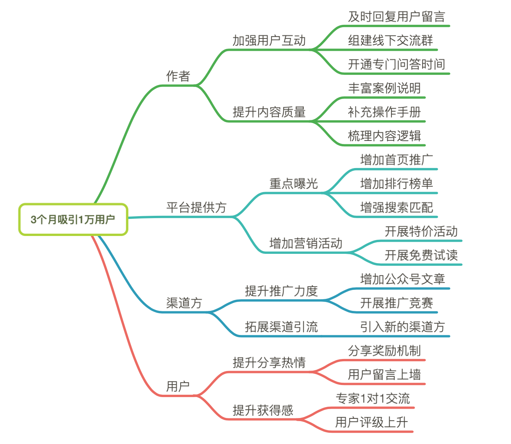

# 影响地图

影响地图是通过简单的“Why-Who-How-What”分析方法，实现业务目标和产品功能之间的映射关系。

* Why 代表目标，它可以是一个核心的业务目标，也可以是一个实际的用户需求。
* Who 代表影响对象，也就是通过影响谁来实现这个目标。
* How 代表影响，也就是怎样影响用户以实现我们的目标。
* What 代表需要交付什么样的功能，可以带来期望的影响。

如果你是第一次接触影响地图，可能会听起来有点晕。没关系，我给你举个例子，来帮你理解这套分析方法。比如，一个专栏希望可以在上线 3 个月内吸引 1 万名用户，那么，这个 Why，也就是最核心的业务目标。为了达成这个目标，需要影响的角色包含哪些呢？其实就包含了作者、平台提供方、渠道方和最终用户。需要对他们施加哪些影响呢？对作者来说，需要快速地回答用户的问题，提升内容的质量；对平台来说，需要对专栏进行重点曝光，增加营销活动；对渠道方来说，需要提高推广力度和渠道引流；对于用户来说，增加分享有礼、免费试读和个人积分等活动。那么基于以上这些影响方式，转化为最终的实际需求，就形成了一张完整的影响地图，如下图所示：

## 原文

[07 \| 业务敏捷：帮助DevOps快速落地的源动力](https://time.geekbang.org/column/article/155791)

