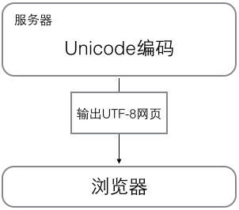

# tutorial


## 输出与输入

> print('hello, world') #输出
> name=input('please enter your name:') #输入

## 基础

### 语法
- 以#开头的语句是注释
- 其他每一行都是一个语句，当语句以冒号:结尾时，缩进的语句视为代码块
- 坚持使用4个空格的缩进
- Python程序是大小写敏感的

### 数据类型
##### 整数
- Python允许在数字中间以_分隔，因此，写成10_000_000_000和10000000000是完全一样的。十六进制数也可以写成0xa1b2_c3d4。
- 整数运算永远是精确的
- /除法计算结果是浮点数，即使是两个整数恰好整除，结果也是浮点数
- 除法是//，称为地板除，两个整数的除法仍然是整数

##### 浮点数
- 浮点数运算则可能会有四舍五入的误差

##### 字符串
- 字符串是以单引号'或双引号"括起来的任意文本
- 可以用转义字符\来标识
- 用'''...'''的格式表示多行内容

##### 布尔值
- 布尔值和布尔代数的表示完全一致
- 布尔值可以用and、or和not运算

##### 空值 
- 空值是Python里一个特殊的值，用None表示。None不能理解为0，因为0是有意义的，而None是一个特殊的空值
  
##### 变量
- 变量不仅可以是数字，还可以是任意数据类型
- 变量名必须是大小写英文、数字和_的组合，且不能用数字开头
- 可以把任意数据类型赋值给变量，同一个变量可以反复赋值，而且可以是不同类型的变量

##### 常量
- 常量就是不能变的变量
- 全部大写的变量名表示常量

### 字符编码

- ASCII编码: 最早只有127个字符被编码到计算机里，也就是大小写英文字母、数字和一些符号
- 中文显然一个字节是不够的，至少需要两个字节，而且还不能和ASCII编码冲突,中国制定了GB2312编码，用来把中文编进去
- 全世界有上百种语言，日本把日文编到Shift_JIS里，韩国把韩文编到Euc-kr里，各国有各国的标准，就会不可避免地出现冲突，结果就是，在多语言混合的文本中，显示出来会有乱码。
- unicode字符集应运而生。Unicode把所有语言都统一到一套编码里，这样就不会再有乱码问题了
- 现代操作系统和大多数编程语言都直接支持Unicode
- 如果统一成Unicode编码，乱码问题从此消失了, 但是，如果你写的文本基本上全部是英文的话，用Unicode编码比ASCII编码需要多一倍的存储空间，在存储和传输上就十分不划算
- 本着节约的精神，又出现了把Unicode编码转化为“可变长编码”的UTF-8编码
- 在计算机内存中，统一使用Unicode编码，当需要保存到硬盘或者需要传输的时候，就转换为UTF-8编码
  
用记事本编辑的时候，从文件读取的UTF-8字符被转换为Unicode字符到内存里，编辑完成后，保存的时候再把Unicode转换为UTF-8保存到文件

  

浏览网页的时候，服务器会把动态生成的Unicode内容转换为UTF-8再传输到浏览器：

  


ASCII编码

最早只有127个字符被编码到计算机里，也就是大小写英文字母、数字和一些符号

GB2312编码

不能和ASCII编码冲突,中国制定了GB2312编码，用来把中文编进去

unicode字符集

Unicode把所有语言都统一到一套编码里

UTF-8编码

UTF-8编码把一个Unicode字符根据不同的数字大小编码成1-6个字节，常用的英文字母被编码成1个字节，汉字通常是3个字节，只有很生僻的字符才会被编码成4-6个字节。如果你要传输的文本包含大量英文字符，用UTF-8编码就能节省空间


##### 字符串
由于Python的字符串类型是str，在内存中以Unicode表示，一个字符对应若干个字节。如果要在网络上传输，或者保存到磁盘上，就需要把str变为以字节为单位的bytes
  
Python对bytes类型的数据用带b前缀的单引号或双引号表示
> x = b'ABC'
> 以Unicode表示的str通过encode()方法可以编码为指定的bytes
> 'ABC'.encode('ascii')
> '中文'.encode('utf-8')
> 如果bytes中只有一小部分无效的字节，可以传入errors='ignore'忽略错误的字节：
> b'\xe4\xb8\xad\xff'.decode('utf-8', errors='ignore')
> 要计算str包含多少个字符，可以用len()函数
> len('ABC')
> len()函数计算的是str的字符数，如果换成bytes，len()函数就计算字节数：
> len(b'ABC')
> 1个中文字符经过UTF-8编码后通常会占用3个字节，而1个英文字符只占用1个字节

纯英文的str可以用ASCII编码为bytes，内容是一样的，含有中文的str可以用UTF-8编码为bytes。含有中文的str无法用ASCII编码，因为中文编码的范围超过了ASCII编码的范围，Python会报错。

> 在操作字符串时，我们经常遇到str和bytes的互相转换。为了避免乱码问题，应当始终坚持使用UTF-8编码对str和bytes进行转换

##### 格式化
1. 'Hello, %s' % 'world'
2. 'Hello, {0}, 成绩提升了 {1:.1f}%'.format('小明', 17.125)
3. f-string


%运算符就是用来格式化字符串的。在字符串内部，%s表示用字符串替换，%d表示用整数替换，有几个%?占位符，后面就跟几个变量或者值，顺序要对应好。如果只有一个%?，括号可以省略

常见的占位符有：

| 占位符| 替换内容 |
| -- | -- |
| %d | 整数 | 
| %f | 浮点数 | 
| %s | 字符串 | 
| %x | 十六进制整数 | 

format()
另一种格式化字符串的方法是使用字符串的format()方法，它会用传入的参数依次替换字符串内的占位符{0}、{1}……，不过这种方式写起来比%要麻烦得多：

f-string

使用以f开头的字符串，称之为f-string，它和普通字符串不同之处在于，字符串如果包含{xxx}，就会以对应的变量替换

> r = 2.5
> s = 3.14 * r ** 2
> print(f'The area of a circle with radius {r} is {s:.2f}')

### list

list是一种有序的集合，可以随时添加和删除其中的元素
内置数据类型
- len
- IndexError
- append
- insert
- pop

### tuple 

tuple和list非常类似，但是tuple一旦初始化就不能修改，

- len
- IndexError
- pop
- 如果可能，能用tuple代替list就尽量用tuple
- 你定义一个tuple时，在定义的时候，tuple的元素就必须被确定下来
- 只有1个元素的tuple定义时必须加一个逗号,，来消除歧义
- t = (1,)


### 条件判断
```python
if <条件判断1>:
    <执行1>
elif <条件判断2>:
    <执行2>
elif <条件判断3>:
    <执行3>
else:
    <执行4>
```


### 循环

- for x in ...循环就是把每个元素代入变量x
- range()函数，可以生成一个整数序列，再通过list()函数可以转换为list
- while循环

### dict 

dict的支持，dict全称dictionary，在其他语言中也称为map，使用键-值（key-value）存储，具有极快的查找速度

- 字典的索引表里（比如部首表）查这个字对应的页码，然后直接翻到该页
- 通过in判断key是否存在
- dict提供的get()方法，如果key不存在，可以返回None，或者自己指定的value
- 用pop(key)方法，对应的value也会从dict中删除
- dict的key必须是不可变对象

> 返回None的时候Python的交互环境不显示结果
> dict内部存放的顺序和key放入的顺序是没有关系的


### set

set和dict类似，也是一组key的集合，但不存储value。由于key不能重复，所以，在set中，没有重复的key。

- 重复元素在set中自动被过滤
- 通过remove(key)方法可以删除元素
- set可以看成数学意义上的无序和无重复元素的集合

交集、并集
```python
s1 = set([1, 2, 3])
s2 = set([2, 3, 4])
s1 & s2 #交集
s1 | s2 #并集
```

### 不可变对象
> 对于不变对象来说，调用对象自身的任意方法，也不会改变该对象自身的内容。相反，这些方法会创建新的对象并返回，这样，就保证了不可变对象本身永远是不可变的


## 函数

- 通过help(abs)查看abs函数的帮助信息
- 函数名其实就是指向一个函数对象的引用，完全可以把函数名赋给一个变量，相当于给这个函数起了一个“别名”
- 定义函数时，需要确定函数名和参数个数；
- 如果有必要，可以先对参数的数据类型做检查；
- 函数体内部可以用return随时返回函数结果；
- 函数执行完毕也没有return语句时，自动return None。
- 函数可以同时返回多个值，但其实就是一个tuple。

函数定义

定义一个函数要使用def语句，依次写出函数名、括号、括号中的参数和冒号:，然后，在缩进块中编写函数体，函数的返回值用return语句返回

空函数

如果想定义一个什么事也不做的空函数，可以用pass语句
```python
def nop():
    pass
```
pass可以用来作为占位符，比如现在还没想好怎么写函数的代码，就可以先放一个pass，让代码能运行起来

返回值 

原来返回值是一个tuple！但是，在语法上，返回一个tuple可以省略括号，而多个变量可以同时接收一个tuple，按位置赋给对应的值，所以，Python的函数返回多值其实就是返回一个tuple，但写起来更方便


### 函数的参数

- 可以用必选参数、默认参数、可变参数、关键字参数和命名关键字参数，这5种参数都可以组合使用
- 请注意，参数定义的顺序必须是：必选参数、默认参数、可变参数、命名关键字参数和关键字参数
- 对于任意函数，都可以通过类似func(*args, **kw)的形式调用它，无论它的参数是如何定义的
- Python的函数具有非常灵活的参数形态，既可以实现简单的调用，又可以传入非常复杂的参数。
- 默认参数一定要用不可变对象，如果是可变对象，程序运行时会有逻辑错误！
- 要注意定义可变参数和关键字参数的语法：
- *args是可变参数，args接收的是一个tuple；
- **kw是关键字参数，kw接收的是一个dict。
- 以及调用函数时如何传入可变参数和关键字参数的语法：
- 可变参数既可以直接传入：func(1, 2, 3)，又可以先组装list或tuple，再通过*args传入：func(*(1, 2, 3))；
- 关键字参数既可以直接传入：func(a=1, b=2)，又可以先组装dict，再通过**kw传入：func(**{'a': 1, 'b': 2})。
- 使用*args和**kw是Python的习惯写法，当然也可以用其他参数名，但最好使用习惯用法。
- 命名的关键字参数是为了限制调用者可以传入的参数名，同时可以提供默认值。
- 定义命名的关键字参数在没有可变参数的情况下不要忘了写分隔符*，否则定义的将是位置参数。
  

> 定义默认参数要牢记一点：默认参数必须指向不变对象！


##### 可变参数
- 可变参数就是传入的参数个数是可变的，可以是1个、2个到任意个，还可以是0个
- 可变参数允许你传入0个或任意个参数，这些可变参数在函数调用时自动组装为一个tuple
- *nums表示把nums这个list的所有元素作为可变参数传进去

##### 关键字参数
  
- 关键字参数允许你传入0个或任意个含参数名的参数，这些关键字参数在函数内部自动组装为一个dict
- `**extra表示把extra这个dict的所有key-value用关键字参数传入到函数的**kw参数`
  
##### 命名关键字参数

- 和关键字参数**kw不同，命名关键字参数需要一个特殊分隔符*，*后面的参数被视为命名关键字参数
- 已经有了一个可变参数，后面跟着的命名关键字参数就不再需要一个特殊分隔符*了
- 如果没有可变参数，就必须加一个*作为特殊分隔符

### 递归
- 使用递归函数的优点是逻辑简单清晰，缺点是过深的调用会导致栈溢出。
- 针对尾递归优化的语言可以通过尾递归防止栈溢出。尾递归事实上和循环是等价的，没有循环语句的编程语言只能通过尾递归实现循环。
- Python标准的解释器没有针对尾递归做优化，任何递归函数都存在栈溢出的问题


## 切片 Slice

list tuple都可用slice操作

```python
L[0:3] # 取前3个元素
L[:3] #从索引0开始取，直到索引3为止
L[1:3] # 从索引1开始，取出2个元素出来
L[-2:] # L[-1]取倒数第一个元素
```

## 迭代 Iteration

- 通过collections模块的Iterable类型判断是否迭代对象
- enumerate函数可以把一个list变成索引-元素对


## 列表生成式

- list(range(1, 11))
- [x * x for x in range(1, 11)]
- [x * x for x in range(1, 11) if x % 2 == 0]
- [m + n for m in 'ABC' for n in 'XYZ']
- d = {'x': 'A', 'y': 'B', 'z': 'C' }
- [k + '=' + v for k, v in d.items()]
- 一个列表生成式中，for前面的if ... else是表达式，而for后面的if是过滤条件，不能带else


## 生成器
一边循环一边计算的机制，称为生成器：generator

创建
- 要把一个列表生成式的[]改成()，就创建了一个generator
- 一个函数定义中包含yield关键字，那么这个函数就不再是一个普通函数，而是一个generator


## 迭代器
- for循环的对象统称为可迭代对象：Iterable
- 可以使用isinstance()判断一个对象是否是Iterable对象  isinstance([], Iterable)
- 可以被next()函数调用并不断返回下一个值的对象称为迭代器：Iterator
- 可以使用isinstance()判断一个对象是否是Iterator对象 isinstance([], Iterator)
- 凡是可作用于for循环的对象都是Iterable类型；
- 凡是可作用于next()函数的对象都是Iterator类型，它们表示一个惰性计算的序列；
- 集合数据类型如list、dict、str等是Iterable但不是Iterator，不过可以通过iter()函数获得一个Iterator对象


> Iterator对象表示的是一个数据流，Iterator对象可以被next()函数调用并不断返回下一个数据，直到没有数据时抛出StopIteration错误。可以把这个数据流看做是一个有序序列，但我们却不能提前知道序列的长度，只能不断通过next()函数实现按需计算下一个数据，所以Iterator的计算是惰性的，只有在需要返回下一个数据时它才会计算
> Iterator甚至可以表示一个无限大的数据流，例如全体自然数。而使用list是永远不可能存储全体自然数的


## 函数式编程

允许把函数本身作为参数传入另一个函数，还允许返回一个函数

### 高阶函数
- map
- reduce
- filter
- sorted
  

### 闭包函数

### 匿名函数
关键字lambda表示匿名函数

### 装饰器
Python的@语法，把decorator置于函数的定义
```pythons
@log
def now():
    print('2015-3-25')
```

### 偏函数

当函数的参数个数太多，需要简化时，使用functools.partial可以创建一个新的函数，这个新函数可以固定住原函数的部分参数，从而在调用时更简单。


## 模块

- 一个.py文件就称之为一个模块（Module）
- 按目录来组织模块的方法，称为包（Package）
- _xxx和__xxx这样的函数或变量就是非公开的（private），不应该被直接引用，比如_abc，__abc等


模块是一组Python代码的集合，可以使用其他模块，也可以被其他模块使用。

创建自己的模块时，要注意：
- 模块名要遵循Python变量命名规范，不要使用中文、特殊字符；
- 模块名不要和系统模块名冲突，最好先查看系统是否已存在该模块，检查方法是在Python交互环境执行import abc，若成功则说明系统存在此模块。


特殊变量
-  __author__ 作者
-  __name__ 
-  __doc__ 

安装第三方
- pip/pip3
  
模块加载
- 直接修改sys.path，添加要搜索的目录
- 设置环境变量PYTHONPATH

## 面向对象
数据封装、继承和多态是面向对象的三大特点

类和实例
- 类中定义的函数只有一点不同，就是第一个参数永远是实例变量self，并且，调用时，不用传递该参数
- 类名通常是大写开头的单词，紧接着是(object)，表示该类是从哪个类继承下来的，继承的概念
- 类是创建实例的模板，而实例则是一个一个具体的对象，各个实例拥有的数据都互相独立，互不影响
- 方法就是与实例绑定的函数，和普通函数不同，方法可以直接访问实例的数据；
- 通过在实例上调用方法，我们就直接操作了对象内部的数据，但无需知道方法内部的实现细节。


特殊变量
- __init__ 初始化

数据封装

访问限制
- 内部属性不被外部访问 属性的名称前加上两个下划线__ 
- 双下划线开头，并且以双下划线结尾的，是特殊变量，特殊变量是可以直接访问的，不是private变量

继承和多态
- 继承可以把父类的所有功能都直接拿过来，这样就不必重零做起，子类只需要新增自己特有的方法，也可以把父类不适合的方法覆盖重写。
- 动态语言的鸭子类型特点决定了继承不像静态语言那样是必须的

获取对象信息
- 判断对象类型，使用type()函数
- 判断class的类型,判断class的继承关系 ，可以使用isinstance()函数。
- 获得一个对象的所有属性和方法，可以使用dir()函数
- len(myObj)的话，就自己写一个__len__()方法
- getattr()、setattr()以及hasattr(),可以直接操作一个对象的状态


实例属性和类属性
- 实例绑定属性的方法是通过实例变量，或者通过self变量
- 我们定义了一个类属性后，这个属性虽然归类所有，但类的所有实例都可以访问到
- 在编写程序的时候，千万不要对实例属性和类属性使用相同的名字，因为相同名称的实例属性将屏蔽掉类属性，但是当你删除实例属性后，再使用相同的名称，访问到的将是类属性。

使用__slots__

定义一个特殊的__slots__变量，来限制该class实例能添加的属性

使用@property
@property广泛应用在类的定义中，可以让调用者写出简短的代码，同时保证对参数进行必要的检查，这样，程序运行时就减少了出错的可能性。

多重继承


定制类
- __str__ #print
- __repr__ #print cli
- __repr__ = __str__ 
- __iter__ # for ... in循环，类似list或tuple那样
- __next__ # for ... in循环，类似list或tuple那样
- __getitem__  # list或dict
- __setitem__ # list或dict
- __delitem__ #list/dict
- __getattr__ #调用类的方法或属性时，如果不存在，
- __call__  #对实例直接调用 
- callable()函数，我们就可以判断一个对象是否是“可调用”对象

枚举类
- Enum类来实现这个功能
- @unique装饰器可以帮助我们检查保证没有重复值

元类
- type()函数既可以返回一个对象的类型，又可以创建出新的类型

要创建一个class对象，type()函数依次传入3个参数：
- class的名称；
- 继承的父类集合，注意Python支持多重继承，如果只有一个父类，别忘了tuple的单元素写法；
- class的方法名称与函数绑定，这里我们把函数fn绑定到方法名hello上。

metaclass
- 先定义metaclass，就可以创建类，最后创建实例


## 错误处理

```python
try...
except: division by zero
finally...
END
```


## 记录错误

Python内置的logging模块可以非常容易地记录错误信息

## 抛出错误

raise语句抛出一个错误

## 调试
- print()
- assert 启动Python解释器时可以用-O参数来关闭assert
- logging
- pdb
- IDE 


## 单元测试 
- 单元测试可以有效地测试某个程序模块的行为，是未来重构代码的信心保证。
- 单元测试的测试用例要覆盖常用的输入组合、边界条件和异常。
- 单元测试代码要非常简单，如果测试代码太复杂，那么测试代码本身就可能有bug。
- 单元测试通过了并不意味着程序就没有bug了，但是不通过程序肯定有bug。


## 文档测试
doctest非常有用，不但可以用来测试，还可以直接作为示例代码。通过某些文档生成工具，就可以自动把包含doctest的注释提取出来。用户看文档的时候，同时也看到了doctest


## 序列化

pickle模块
```python
import pickle
d = dict(name='Bob', age=20, score=88)
pickle.dumps(d)

f = open('dump.txt', 'wb')
pickle.dump(d, f)
f.close()

# 反序列化
f = open('dump.txt', 'rb')
d = pickle.load(f)
f.close()
```


## json
JSON表示的对象就是标准的JavaScript语言的对象，JSON和Python内置的数据类型对应如下：

| JSON类型 |	Python类型 |
| -- | -- |
| {}| dict |
| []| list |
| "string"| str |
| 1234.56| int或float |
| true/false| True/False |
| null| None |

## 读取文件
```python
with open('/path/to/file', 'r') as f:
    print(f.read())

# 配置文件
for line in f.readlines():
    print(line.strip()) # 把末尾的'\n'删掉

f = open('/Users/michael/gbk.txt', 'r', encoding='gbk')
f.read()

# 忽略编码错误
f = open('/Users/michael/gbk.txt', 'r', encoding='gbk', errors='ignore')

with open('/Users/michael/test.txt', 'w') as f:
    f.write('Hello, world!')
```

> 可以反复调用read(size)方法，每次最多读取size个字节的内容

StringIO/BytesIO
StringIO和BytesIO是在内存中操作str和bytes的方法，使得和读写文件具有一致的接口


## os模块
```python
os.name # 操作系统类型
os.uname() #系统信息
os.environ
os.environ.get('PATH')
os.environ.get('x', 'default')
#查看当前目录的绝对路径:
os.path.abspath('.')
# 在某个目录下创建一个新目录，首先把新目录的完整路径表示出来:
os.path.join('/Users/michael', 'testdir')

# 然后创建一个目录:
os.mkdir('/Users/michael/testdir')
# 删掉一个目录:
os.rmdir('/Users/michael/testdir')
#路径拆分为两部分，后一部分总是最后级别的目录或文件名
os.path.split('/Users/michael/testdir/file.txt')
#扩展名
os.path.splitext('/path/to/file.txt')
# 对文件重命名:
os.rename('test.txt', 'test.py')
# 删掉文件:
os.remove('test.py')
# 列出目录
[x for x in os.listdir('.') if os.path.isdir(x)]
# 列出所.py文件
[x for x in os.listdir('.') if os.path.isfile(x) and os.path.splitext(x)[1]=='.py']
```

## shutil模块
```python
copyfile()

```

## 进程和线程

线程是最小的执行单元，而进程由至少一个线程组成。如何调度进程和线程，完全由操作系统决定，程序自己不能决定什么时候执行，执行多长时间。
多进程和多线程的程序涉及到同步、数据共享的问题，编写起来更复杂。

- 在Unix/Linux下，可以使用fork()调用实现多进程。
- 要实现跨平台的多进程，可以使用multiprocessing模块。
- 进程间通信是通过Queue、Pipes等实现的

- 多线程编程，模型复杂，容易发生冲突，必须用锁加以隔离，同时，又要小心死锁的发生。
- Python解释器由于设计时有GIL全局锁，导致了多线程无法利用多核。多线程的并发在Python中就是一个美丽的梦

- 一个ThreadLocal变量虽然是全局变量，但每个线程都只能读写自己线程的独立副本，互不干扰。ThreadLocal解决了参数在一个线程中各个函数之间互相传递的问题


## 正则表达式


## datetime
```python
from datetime import datetime
now = datetime.now() # 获取当前datetime

dt = datetime(2015, 4, 19, 12, 20) # 用指定日期时间创建datetime

dt = datetime(2015, 4, 19, 12, 20) # 用指定日期时间创建datetime

dt.timestamp() # 把datetime转换为timestamp

t = 1429417200.0
print(datetime.fromtimestamp(t)) # 本地时间
print(datetime.utcfromtimestamp(t)) # UTC时间
cday = datetime.strptime('2015-6-1 18:19:59', '%Y-%m-%d %H:%M:%S') #str转换为datetime
print(now.strftime('%a, %b %d %H:%M')) # datetime转换为str

## 日期加减
>>> now + timedelta(hours=10)
datetime.datetime(2015, 5, 19, 2, 57, 3, 540997)
>>> now - timedelta(days=1)
datetime.datetime(2015, 5, 17, 16, 57, 3, 540997)
>>> now + timedelta(days=2, hours=12)
datetime.datetime(2015, 5, 21, 4, 57, 3, 540997)

tz_utc_8 = timezone(timedelta(hours=8)) # 创建时区UTC+8:00
dt = now.replace(tzinfo=tz_utc_8) # 强制设置为UTC+8:


# 拿到UTC时间，并强制设置时区为UTC+0:00:
utc_dt = datetime.utcnow().replace(tzinfo=timezone.utc)
print(utc_dt)
# 2015-05-18 09:05:12.377316+00:00
# astimezone()将转换时区为北京时间:
bj_dt = utc_dt.astimezone(timezone(timedelta(hours=8)))
print(bj_dt)
# 2015-05-18 17:05:12.377316+08:00
# astimezone()将转换时区为东京时间:
tokyo_dt = utc_dt.astimezone(timezone(timedelta(hours=9)))
print(tokyo_dt)
# 2015-05-18 18:05:12.377316+09:00
# astimezone()将bj_dt转换时区为东京时间:
tokyo_dt2 = bj_dt.astimezone(timezone(timedelta(hours=9)))
print(tokyo_dt2)
# 2015-05-18 18:05:12.377316+09:00

```


## collections

namedtuple

```python
>>> from collections import namedtuple
>>> Point = namedtuple('Point', ['x', 'y'])
>>> p = Point(1, 2)
>>> p.x
1
>>> p.y
2

```

## deque

deque是为了高效实现插入和删除操作的双向列表，适合用于队列和栈

```python
>>> from collections import deque
>>> q = deque(['a', 'b', 'c'])
>>> q.append('x')
>>> q.appendleft('y')
>>> q
deque(['y', 'a', 'b', 'c', 'x'])

```

## defaultdict

用dict时，如果引用的Key不存在，就会抛出KeyError。如果希望key不存在时，返回一个默认值，就可以用defaultdict

## OrderedDict
使用dict时，Key是无序的。在对dict做迭代时，我们无法确定Key的顺序

## ChainMap
ChainMap可以把一组dict串起来并组成一个逻辑上的dict。ChainMap本身也是一个dict，但是查找的时候，会按照顺序在内部的dict依次查找

## Counter
Counter是一个简单的计数器，例如，统计字符出现的个数


## base64

Base64是一种用64个字符来表示任意二进制数据的方法
Base64是一种任意二进制到文本字符串的编码方法，常用于在URL、Cookie、网页中传输少量二进制数据。

## struct
struct模块来解决bytes和其他二进制数据类型的转换

## hashlib 

## hmac

## itertools
itertools提供了非常有用的用于操作迭代对象的函数

- count() 停不下来
- cycle() 无限重复
- repeat() 无限重复
- 无限序列虽然可以无限迭代下去，但是通常我们会通过takewhile()等函数根据条件判断来截取出一个有限的序列
- chain()可以把一组迭代对象串联起来，形成一个更大的迭代器
- groupby()把迭代器中相邻的重复元素挑出来放在一起

## contextlib
任何对象，只要正确实现了上下文管理，就可以用于with语句
实现上下文管理是通过__enter__和__exit__这两个方法实现的

- @contextmanager 自动上下文 yield 通过编写generator来简化上下文管理
- @closing cosing也是一个经过@contextmanager装饰的generator


## 第三方模块
- Pillow 图像处理
- requests http
- chardet 字符串编码 
- psutil 系统监控


## 异步io

- 协程 yield
- asyncio
- async/await
- aiohttp

```python

async def hello():
    print("Hello world!")
    r = await asyncio.sleep(1)
    print("Hello again!")
```